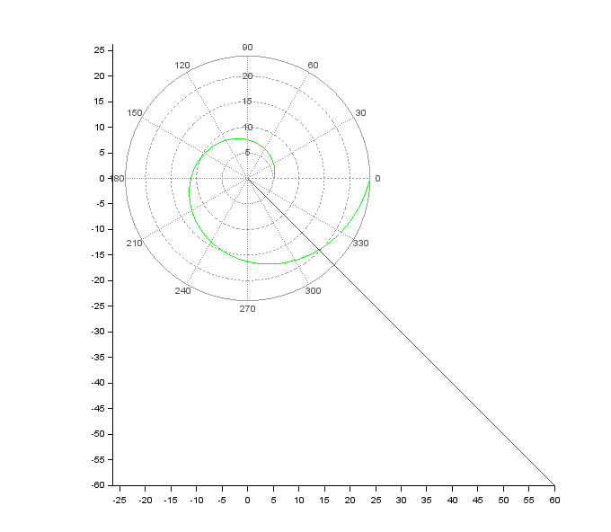
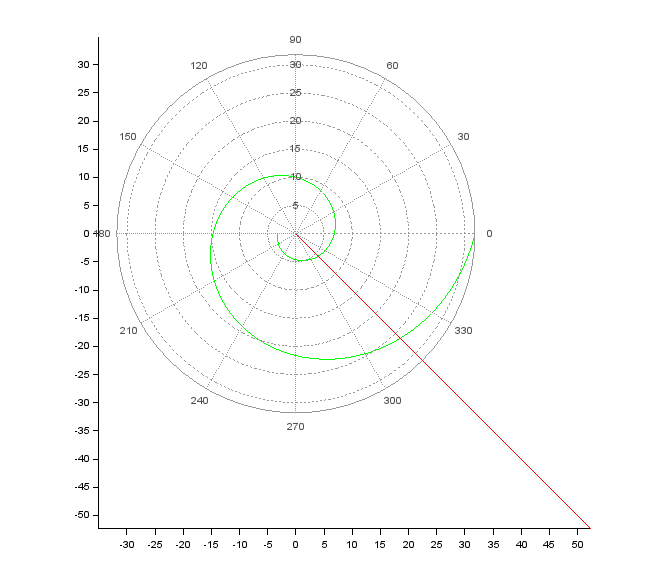

---
# Front matter
title: "Лабораторная работа №2"
subtitle: "Математическое моделирование"
author: "Асеева Яна Олеговна"

# Generic otions
lang: ru-RU
toc-title: "Содержание"

# Bibliography
bibliography: bib/cite.bib
csl: pandoc/csl/gost-r-7-0-5-2008-numeric.csl

# Pdf output format
toc: true # Table of contents
toc_depth: 2
lof: true # List of figures
lot: true # List of tables
fontsize: 12pt
linestretch: 1.5
papersize: a4
documentclass: scrreprt
## I18n
polyglossia-lang:
  name: russian
  options:
	- spelling=modern
	- babelshorthands=true
polyglossia-otherlangs:
  name: english
### Fonts
mainfont: PT Serif
romanfont: PT Serif
sansfont: PT Sans
monofont: PT Mono
mainfontoptions: Ligatures=TeX
romanfontoptions: Ligatures=TeX
sansfontoptions: Ligatures=TeX,Scale=MatchLowercase
monofontoptions: Scale=MatchLowercase,Scale=0.9
## Biblatex
biblatex: true
biblio-style: "gost-numeric"
biblatexoptions:
  - parentracker=true
  - backend=biber
  - hyperref=auto
  - language=auto
  - autolang=other*
  - citestyle=gost-numeric
## Misc options
indent: true
header-includes:
  - \linepenalty=10 # the penalty added to the badness of each line within a paragraph (no associated penalty node) Increasing the value makes tex try to have fewer lines in the paragraph.
  - \interlinepenalty=0 # value of the penalty (node) added after each line of a paragraph.
  - \hyphenpenalty=50 # the penalty for line breaking at an automatically inserted hyphen
  - \exhyphenpenalty=50 # the penalty for line breaking at an explicit hyphen
  - \binoppenalty=700 # the penalty for breaking a line at a binary operator
  - \relpenalty=500 # the penalty for breaking a line at a relation
  - \clubpenalty=150 # extra penalty for breaking after first line of a paragraph
  - \widowpenalty=150 # extra penalty for breaking before last line of a paragraph
  - \displaywidowpenalty=50 # extra penalty for breaking before last line before a display math
  - \brokenpenalty=100 # extra penalty for page breaking after a hyphenated line
  - \predisplaypenalty=10000 # penalty for breaking before a display
  - \postdisplaypenalty=0 # penalty for breaking after a display
  - \floatingpenalty = 20000 # penalty for splitting an insertion (can only be split footnote in standard LaTeX)
  - \raggedbottom # or \flushbottom
  - \usepackage{float} # keep figures where there are in the text
  - \floatplacement{figure}{H} # keep figures where there are in the text


---

# Цель работы                                                                                                 

Научиться работать с Scilab, решать задачу о погоне, строить графики траектории движения.

# Теоретическая справка

Scilab — пакет прикладных математических программ, предоставляющий открытое окружение для инженерных (технических) и научных расчётов. Scilab позволяет работать с элементарными и большим числом специальных функций (Бесселя, Неймана, интегральные функции), имеет мощные средства работы с матрицами, полиномами (в том числе и символьно), производить численные вычисления (например, численное интегрирование) и решение задач линейной алгебры, оптимизации и симуляции, мощные статистические функции, а также средство для построения и работы с графиками.

# Ход работы

## 1.1 Задача

На море в тумане катер береговой охраны преследует лодку браконьеров. Через определенный промежуток времени туман рассеивается, и лодка обнаруживается на расстоянии 16,4 км от катера. Затем лодка снова скрывается в тумане и уходит прямолинейно в неизвестном направлении. Известно, что скорость катера в 4,2 раза больше скорости браконьерской лодки. 

1. Запишите уравнение, описывающее движение катера, с начальными условиями для двух случаев (в зависимости от расположения катера относительно лодки в начальный момент времени). 
2. Постройте траекторию движения катера и лодки для двух случаев. 
3. Найдите точку пересечения траектории катера и лодки. 


## 1.2 Постановка задачи 

1. Пусть место нахождения лодки браконьеров в момент обнаружения:  t_0=0,x_{л0}=0 . Пусть место нахождения катера береговой охраны относительно лодки браконьеров в момент обнаружения лодки: x_{к0}=0.
2. Введем полярные координаты. Будем считать, что полюс - это точка обнаружения лодки браконьеров x_{л0} (0=x_{л0}=0) , а полярная ось r проходит через точку нахождения катера  береговой охраны.
3. Траектория катера должна быть такой, чтобы и катер, и лодка все время были на одном расстоянии от полюса, только в этом случае траектория катера пересечется с траекторией лодки. Поэтому для начала катер береговой охраны должен двигаться некоторое время прямолинейно, пока не окажется на том же расстоянии от полюса, что и лодка браконьеров. После этого катер береговой охраны должен двигаться вокруг полюса удаляясь от него с той же скоростью, что и лодка браконьеров.
4. Чтобы найти расстояние X (расстояние, после которого катер начнет двигаться вокруг полюса),
    необходимо составить простое уравнение. Пусть через время t катер и лодка окажутся на одном расстоянии x от полюса. За это время лодка пройдет x, а катер — k-x (или k+x в зависимости
    от начального положения катера относительно полюса). Время, за которое они пройдут это расстояние, вычисляется как x/v или k-x/4.2v (во втором случае k+x/4.2v). Так как время одно и то 
    же, то эти величины одинаковы. Тогда неизвестное расстояние x можно найти из следующего уравнения:x/v=(k-x)/4.2v в первом случае и x/v=(k+x)/4.2v во втором. Отсюда мы найдем два значения x_1=k/5.2 и x_2=k/3.2 , задачу будем решать для двух случаев.
5. После того, как катер береговой охраны окажется на одном расстоянии от полюса, что и лодка, он должен сменить прямолинейную траекторию и начать двигаться вокруг полюса, удаляясь от него со скоростью лодки v. Для этого скорость катера раскладываем на две составляющие: v_r — радиальная 
    скорость и v_τ — тангенциальная скорость. Радиальная скорость - это скорость, с которой катер 
    удаляется от полюса, v_r=dr/dt. Нам нужно, чтобы эта скорость была равна скорости лодки, поэтому полагаем dr/dt=v. Тангенциальная скорость – это линейная скорость вращения катера
    относительно полюса. Она равна произведению угловой скорости ∂θ/∂t на радиус r, v_τ=r*∂θ/∂t
    v_τ=√(17.64v^2-v^2 )=√16.6*v (учитывая, что радиальная скорость равна v). Тогда получаем r*∂θ∂t=√14.21*v.
6. Решение исходной задачи сводится к решению системы из двух дифференциальных уравнений. Далее, исключая из полученной системы  производную по t, переходим к одному уравнению: ∂r/∂θ=r/√16.64. При этом, начальные условия остаются прежними. Решив это уравнение, мы получаем
траекторию движения катера в полярных координатах.


## 1.3 Код

```Scilab
//начальные условия в случае 1
r0=16.4/3.2;
tetha0=0;

//начальные условия в случае 2
//r0=16.4/5.2
//tetha0=-%pi;

//функция, которая описывает движение катера береговой охраны
function dr=f(tetha, r)
    dr=r/sqrt(16.64);
endfunction;

//функция, описывающая движение лодки браконьеров
function xt=f2(t)
    xt=tan(fi)*t;
endfunction

fi=3*%pi/4;
tetha=tetha0:0.001:2*%pi;
r=ode(r0,tetha0,tetha,f);
t=0:1:800;

//построение траектории движения катера и лодки, зеленым и красным цветом соответственно 
polarplot(tetha,r,style = color('green'));
plot2d(t,f2(t),style = color('red'));
```


## 1.4 Полученные графики

Первый случай (рис.1):



Второй случай (рис.2):




# Вывод

В ходе выполнения лабораторной работы я освоила Scilab, научилась решать задачу о погоне и строить графики, записала уравнение, описывающее движение катера, с начальными условиями для двух случаев (в зависимости от расположения катера относительно лодки в начальный момент времени),  построила траекторию движения катера и лодки для двух случаев, нашла точку пересечения траектории катера и лодки. 
