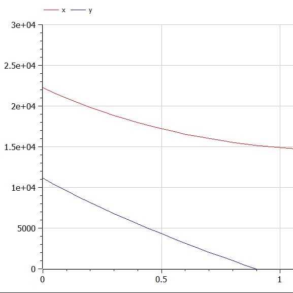
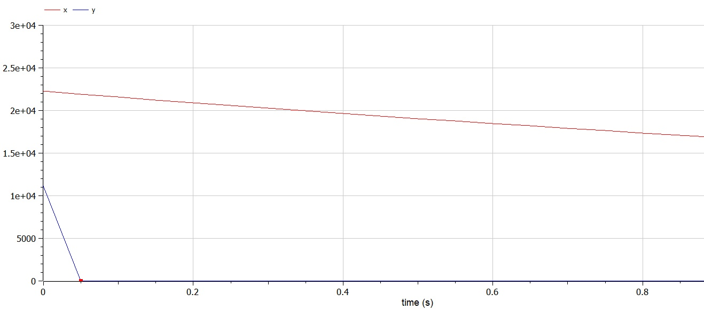

---
# Front matter
title: "Лабораторная работа №3"
subtitle: "Математическое моделирование"
author: Асеева Яна Олеговна

# Generic otions
lang: ru-RU
toc-title: Содержание

# Bibliography
bibliography: bib/cite.bib
csl: pandoc/csl/gost-r-7-0-5-2008-numeric.csl

# Pdf output format
toc: true # Table of contents
toc_depth: 2
lof: true # List of figures
lot: true # List of tables
fontsize: 12pt
linestretch: 1.5
papersize: a4
documentclass: scrreprt
## I18n
polyglossia-lang:
  name: russian
  options:
	- spelling=modern
	- babelshorthands=true
polyglossia-otherlangs:
  name: english
### Fonts
mainfont: PT Serif
romanfont: PT Serif
sansfont: PT Sans
monofont: PT Mono
mainfontoptions: Ligatures=TeX
romanfontoptions: Ligatures=TeX
sansfontoptions: Ligatures=TeX,Scale=MatchLowercase
monofontoptions: Scale=MatchLowercase,Scale=0.9
## Biblatex
biblatex: true
biblio-style: "gost-numeric"
biblatexoptions:
  - parentracker=true
  - backend=biber
  - hyperref=auto
  - language=auto
  - autolang=other*
  - citestyle=gost-numeric
## Misc options
indent: true
header-includes:
  - \linepenalty=10 # the penalty added to the badness of each line within a paragraph (no associated penalty node) Increasing the value makes tex try to have fewer lines in the paragraph.
  - \interlinepenalty=0 # value of the penalty (node) added after each line of a paragraph.
  - \hyphenpenalty=50 # the penalty for line breaking at an automatically inserted hyphen
  - \exhyphenpenalty=50 # the penalty for line breaking at an explicit hyphen
  - \binoppenalty=700 # the penalty for breaking a line at a binary operator
  - \relpenalty=500 # the penalty for breaking a line at a relation
  - \clubpenalty=150 # extra penalty for breaking after first line of a paragraph
  - \widowpenalty=150 # extra penalty for breaking before last line of a paragraph
  - \displaywidowpenalty=50 # extra penalty for breaking before last line before a display math
  - \brokenpenalty=100 # extra penalty for page breaking after a hyphenated line
  - \predisplaypenalty=10000 # penalty for breaking before a display
  - \postdisplaypenalty=0 # penalty for breaking after a display
  - \floatingpenalty = 20000 # penalty for splitting an insertion (can only be split footnote in standard LaTeX)
  - \raggedbottom # or \flushbottom
  - \usepackage{float} # keep figures where there are in the text
  - \floatplacement{figure}{H} # keep figures where there are in the text


---

# Цель работы                                                                                                 

Научиться работать в OpenModelica. Рассмотреть простейшую модель боевых действий – модель Ланчестера. Научиться строить графики для данной модели.

# Теоретическая справка

Modelica — объектно-ориентированный, декларативный, мультидоменный язык моделирования для компонентно-ориентированного моделирования сложных систем, в частности, систем, содержащих механические, электрические, электронные, гидравлические, тепловые, энергетические компоненты, а также компоненты управления и компоненты, ориентированные на отдельные процессы.

Модель Ланчестера. В противоборстве могут принимать участие как регулярные войска, так и партизанские отряды. В общем случае главной характеристикой соперников являются численности сторон. Если в какой-то момент времени одна из численностей обращается в нуль, то данная сторона считается проигравшей (при условии, что численность другой стороны в данный момент положительна).

# Ход работы

**1. Постановка задачи**

Вариант 45. Между страной Х и страной У идет война. Численность состава войск исчисляется от начала войны, и являются временными функциями x(t) и y(t). В начальный момент времени страна Х имеет армию численностью 22 222 человек, а в распоряжении страны У армия численностью в 11 111 человек. Для упрощения модели считаем, что коэффициенты a, b, c, h постоянны. Также считаем P(t) и Q(t) непрерывные функции. Постройте графики изменения численности войск армии Х и армии У для следующих случаев: 

1. Модель боевых действий между регулярными войсками

$$
dx/dt = -0,22x(t)-0,77y(t)+sin(0,5t)+2;
dy/dt = -0,66x(t)-0,11y(t)+cos(0,5t)+2.
$$

2. Модель ведение боевых действий с участием регулярных войск и партизанских отрядов 

$$
dx/dt = -0,31x(t)-0,79y(t)+sin(2,5t)+2;
dy/dt = -0,59x(t)y(t)-0,21y(t)+cos(2t)+2.
$$

**2. Решение**

Рассмотри три случая ведения боевых действий:

1. Боевые действия между регулярными войсками

2. Боевые действия с участием регулярных войск и партизанских отрядов 

3.  Боевые действия между партизанскими отрядами

   В первом случае численность регулярных войск определяется тремя факторами: 

   скорость уменьшения численности войск из-за причин, не связанных с боевыми действиями (болезни, травмы, дезертирство); 

   скорость потерь, обусловленных боевыми действиями противоборствующих сторон (что связанно с качеством стратегии, уровнем вооружения, профессионализмом солдат и т.п.); 

   скорость поступления подкрепления (задаётся некоторой функцией от времени). 

   

В этом случае модель боевых действий между регулярными войсками описывается следующим образом
$$
dx/dt = -a(t)x(t)-b(t)y(t)+P(t); dy/dt = -c(t)x(t)-h(t)y(t)+Q(t)
$$


Потери, не связанные с боевыми действиями, описывают члены -a(t)x(t) и -h(t)y(t) , члены -b(t)y(t) и -c(t)x(t) отражают потери на поле боя. Коэффициенты b(t) и c(t) указывают на эффективность боевых действий со стороны у и х соответственно, a(t), h(t) - величины, характеризующие степень влияния различных факторов на потери. Функции P(t), Q(t) учитывают  возможность подхода подкрепления к войскам Х и У в течение одного дня.

Во втором случае в борьбу добавляются партизанские отряды. Нерегулярные войска в отличии от постоянной армии менее уязвимы, так как действуют скрытно, в этом случае сопернику приходится действовать неизбирательно, по площадям, занимаемым партизанами. Поэтому считается, что тем потерь партизан, проводящих свои операции в разных местах на некоторой известной территории, пропорционален не только численности армейских соединений, но и численности самих партизан. В результате модель принимает вид (в этой системе все величины имею тот же смысл):
$$
dx/dt = -a(t)x(t)-b(t)y(t)+P(t); dy/dt = -c(t)x(t)y(t)-h(t)y(t)+Q(t)
$$


**2.1 Случай 1**

```
model zadacha01
// Cлучай 1: Модель боевых действий регулярных войск
parameter Real t; //время
constant Real a=0.22; //константа, характеризующая степень влияния различных факторов на потери
constant Real b=0.77; //эффективность боевых действий для армии y
constant Real c=0.66; //эффективность боевых действий для армии x
constant Real h=0.11; //константа, характеризующая степень влияния различных факторов на потери
Real p;
Real q;
Real x;
Real y;
initial equation
x=22222; //численность армии в X
y=11111; //численность армии в Y
t=0;
equation
p= sin(0.5*t) + 2; //возможность подхода подкрепления к войскам X
q= cos(0.5*t) + 2; //возможность подхода подкрепления к войскам Y
der(x)=-a*x-b*y+p;
der(y)=-c*x-h*y+q;
end zadacha01;
```

Получили график для первого случая (рис.1):



**2.2 Случай 2**

```
model zadacha02
// Cлучай 2: Модель боевых действий регулярных войск и партизанских отрядов
parameter Real t; //время
constant Real a=0.31; //константа, характеризующая степень влияния различных факторов на потери
constant Real b=0.79; //эффективность боевых действий для армии y
constant Real c=0.59; //эффективность боевых действий для армии x
constant Real h=0.21; //константа, характеризующая степень влияния различных факторов на потери
Real p;
Real q;
Real x;
Real y;
initial equation
x=22222; //численность армии в X
y=11111; //численность армии в Y
t=0;
equation
p= sin(2.5*t) + 1; //возможность подхода подкрепления к войскам X
q= cos(2*t) + 2; //возможность подхода подкрепления к войскам Y
der(x)=-a*x-b*y+p;
der(y)=-c*x*y-h*y+q;

end zadacha02;
```

Получили график для второго случая (рис.2):



# Вывод

В ходе выполнения лабораторной работы я освоила OpenModelica, рассмотрела простейшую модель боевых действий – модель Ланчестера, научилась строить графики для данной модели.

# Список литературы

Кулябов Д. С.  *Лабораторная работа №3*: https://esystem.rudn.ru/mod/resource/view.php?id=831037

