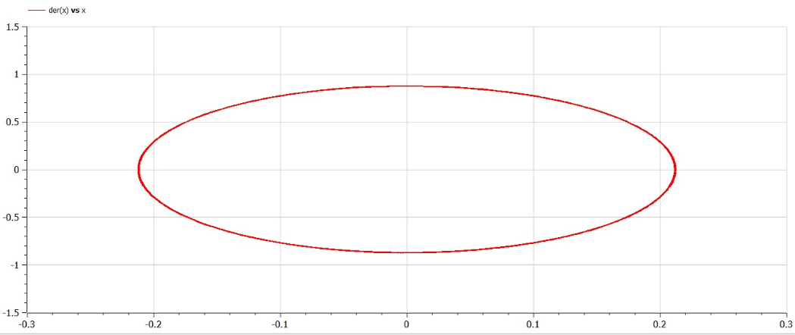
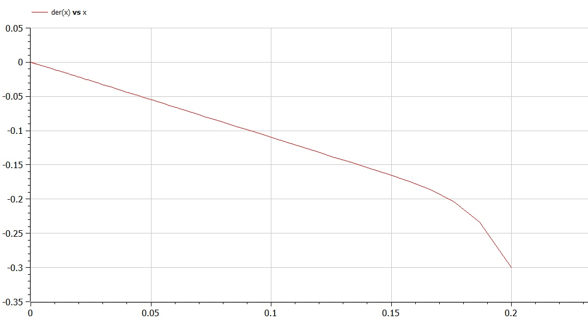
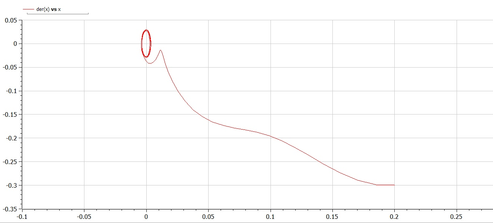

---
## Front matter
lang: ru-RU
title: Лабораторная работа №4
author: Асеева Яна Олеговна
documentclass: article
papersize: a4
toc: false
slide_level: 2
aspectratio: 20
section-titles: true
##Fonts
fontsize: 12pt
mainfont: PT Serif
romanfont: PT Serif
sansfont: PT Sans
monofont: PT Mono
mainfontoptions: Ligatures=TeX
romanfontoptions: Ligatures=TeX
sansfontoptions: Ligatures=TeX,Scale=MatchLowercase
monofontoptions: Scale=MatchLowercase,Scale=0.9
---

# 
Лабораторная работа №4

**Автор: Асеева Яна Олеговна**

**Группа: НКНбд-01-19**

## Прагматика выполнения

- Познакомиться с моделями гармонических колебаний с затуханием и без затухания, под действием внешних сил и без действия внешних сил

- Научиться строить фазовые портреты с помощью OpenModelica

- Применение полученных знаний на практике в дальнейшем

  

## Цели

- Научиться работать с OpenModelica

- Построить фазовый портрет гармонического осциллятора

- Решить уравнения гармонического осциллятора

- Получение новых знаний в ходе выполнения лабораторной работы

  

## Определение гармонических колебаний 

Гармонические колебания — колебания, при которых физическая величина изменяется с течением времени по гармоническому (синусоидальному, косинусоидальному) закону.

## Задание

Постройте фазовый портрет гармонического осциллятора и решение уравнения гармонического осциллятора для следующих случаев:

1.Колебания гармонического осциллятора без затуханий и без действий внешней силы 
$$
\ddot{x}+17x=0
$$
2.Колебания гармонического осциллятора c затуханием и без действий внешней силы 
$$
\ddot{x}+22\dot{x}+23x=0
$$

3.Колебания гармонического осциллятора c затуханием и под действием внешней силы 
$$
\ddot{x}+5\dot{x}+8x=0,25sin(8t)
$$
На интервале 
$$
t\in [0,58]
$$
(шаг 0,05) с начальными условиями 
$$
x_0=0,2,y_0=-0,3
$$

## Полученный график для случая 1

  

## Полученный график для случая 2

  

## Полученный график для случая 3

  

## Результаты лабораторной работы

- Мы научились работать в OpenModelica

- Научились решать уравнения гармонического осциллятора

- Научились строить фазовые портреты 

  
  

    
  
    
  
    
  
    ### 
Спасибо за внимание!

