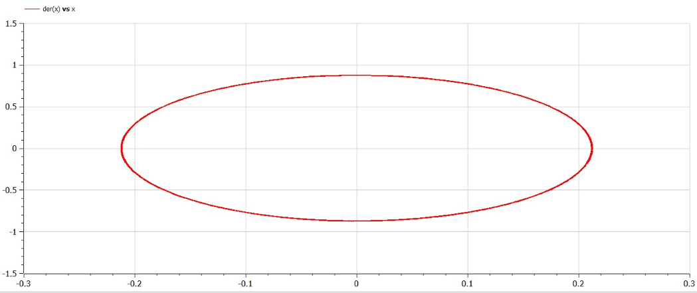
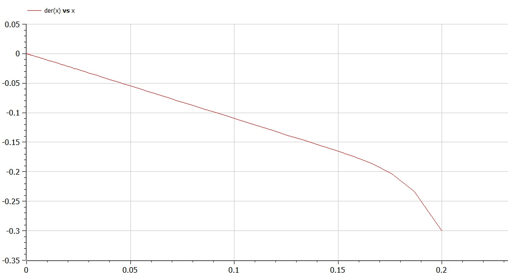
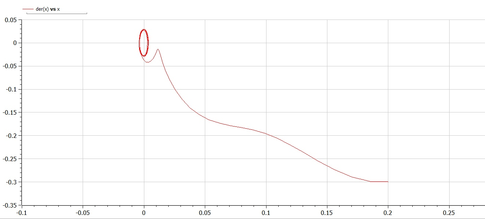

---
# Front matter
title: "Лабораторная работа №4"
subtitle: "Математическое моделирование"
author: Асеева Яна Олеговна

# Generic otions
lang: ru-RU
toc-title: Содержание

# Bibliography
bibliography: bib/cite.bib
csl: pandoc/csl/gost-r-7-0-5-2008-numeric.csl

# Pdf output format
toc: true # Table of contents
toc_depth: 2
lof: true # List of figures
lot: true # List of tables
fontsize: 12pt
linestretch: 1.5
papersize: a4
documentclass: scrreprt
## I18n
polyglossia-lang:
  name: russian
  options:
	- spelling=modern
	- babelshorthands=true
polyglossia-otherlangs:
  name: english
### Fonts
mainfont: PT Serif
romanfont: PT Serif
sansfont: PT Sans
monofont: PT Mono
mainfontoptions: Ligatures=TeX
romanfontoptions: Ligatures=TeX
sansfontoptions: Ligatures=TeX,Scale=MatchLowercase
monofontoptions: Scale=MatchLowercase,Scale=0.9
## Biblatex
biblatex: true
biblio-style: "gost-numeric"
biblatexoptions:
  - parentracker=true
  - backend=biber
  - hyperref=auto
  - language=auto
  - autolang=other*
  - citestyle=gost-numeric
## Misc options
indent: true
header-includes:
  - \linepenalty=10 # the penalty added to the badness of each line within a paragraph (no associated penalty node) Increasing the value makes tex try to have fewer lines in the paragraph.
  - \interlinepenalty=0 # value of the penalty (node) added after each line of a paragraph.
  - \hyphenpenalty=50 # the penalty for line breaking at an automatically inserted hyphen
  - \exhyphenpenalty=50 # the penalty for line breaking at an explicit hyphen
  - \binoppenalty=700 # the penalty for breaking a line at a binary operator
  - \relpenalty=500 # the penalty for breaking a line at a relation
  - \clubpenalty=150 # extra penalty for breaking after first line of a paragraph
  - \widowpenalty=150 # extra penalty for breaking before last line of a paragraph
  - \displaywidowpenalty=50 # extra penalty for breaking before last line before a display math
  - \brokenpenalty=100 # extra penalty for page breaking after a hyphenated line
  - \predisplaypenalty=10000 # penalty for breaking before a display
  - \postdisplaypenalty=0 # penalty for breaking after a display
  - \floatingpenalty = 20000 # penalty for splitting an insertion (can only be split footnote in standard LaTeX)
  - \raggedbottom # or \flushbottom
  - \usepackage{float} # keep figures where there are in the text
  - \floatplacement{figure}{H} # keep figures where there are in the text


---

# Цель работы                                                                                                 

Построить фазовый портрет гармонического осциллятора и решить уравнения гармонического осциллятора.

# Теоретическая справка

Гармонические колебания — колебания, при которых физическая величина изменяется с течением времени по гармоническому (синусоидальному, косинусоидальному) закону.

Гармонические колебания выделяются из всех остальных видов колебаний по следующим причинам:

- Очень часто малые колебания, как свободные, так и вынужденные, которые происходят в реальных системах, можно считать имеющими форму гармонических колебаний или очень близкую к ней.
- Как установил в 1822 году Фурье, широкий класс периодических функций может быть разложен на сумму тригонометрических компонентов — в ряд Фурье. Другими словами, любое периодическое колебание может быть представлено как сумма гармонических колебаний с соответствующими амплитудами, частотами и начальными фазами. Среди слагаемых этой суммы существует гармоническое колебание с наименьшей частотой, которая называется основной частотой, а само это колебание — первой гармоникой или основным тоном, частоты же всех остальных слагаемых, гармонических колебаний, кратны основной частоте, и эти колебания называются высшими гармониками или обертонами — первым, вторым и т.д.
- Для широкого класса систем откликом на гармоническое воздействие является гармоническое колебание (свойство линейности), при этом связь воздействия и отклика является устойчивой характеристикой системы. С учётом предыдущего свойства это позволяет исследовать прохождение колебаний произвольной формы через системы.

# Ход работы

**1. Постановка задачи**

Вариант 45. Постройте фазовый портрет гармонического осциллятора и решение уравнения гармонического осциллятора для следующих случаев:

1.Колебания гармонического осциллятора без затуханий и без действий внешней силы 
$$
\ddot{x}+17x=0
$$
2.Колебания гармонического осциллятора c затуханием и без действий внешней силы 
$$
\ddot{x}+22\dot{x}+23x=0
$$


3.Колебания гармонического осциллятора c затуханием и под действием внешней силы 
$$
\ddot{x}+5\dot{x}+8x=0,25sin(8t)
$$
На интервале 
$$
t\in [0,58]
$$
(шаг 0,05) с начальными условиями
$$
x_0=0,2,y_0=-0,3
$$


**2. Решение**

Движение грузика на пружинке, маятника, заряда в электрическом контуре, а также эволюция во времени многих систем в физике, химии, биологии и других науках при определенных предположениях можно описать одним и тем же дифференциальным уравнением, которое в теории колебаний выступает в качестве основной модели. Эта модель называется линейным гармоническим осциллятором. Уравнение свободных колебаний гармонического осциллятора имеет следующий вид: 
$$
\ddot{x}+2\gamma\dot{x}+w_0^2x=0
$$
Это уравнение есть линейное однородное дифференциальное уравнение второго порядка и оно является примером линейной динамической системы.

При отсутствии потерь в системе вместо этого уравнения получаем уравнение консервативного осциллятора энергия колебания которого сохраняется во времени:
$$
\ddot{x}+w_0^2x=0
$$
Для однозначной разрешимости уравнения второго порядка необходимо задать два начальных условия вида:
$$
x(t_0)=x_0;\dot{x}(t_0)=y_0
$$
Уравнение второго порядка можно представить в виде системы двух уравнений первого порядка:
$$
\dot{x}=y;\dot{y}=-w_0^2x
$$
Начальные условия  для системы примут вид:
$$
x(t_0)=x_0;y(t_0)=y_0
$$
Независимые переменные x, y определяют пространство, в котором «движется» решение. Это фазовое пространство системы, поскольку оно двумерно будем называть его фазовой плоскостью. 

Значение фазовых координат x, y в любой момент времени полностью определяет состояние системы. Решению уравнения движения как функции времени отвечает гладкая кривая в фазовой плоскости. Она называется фазовой траекторией. Если множество различных решений (соответствующих различным  начальным условиям) изобразить на одной фазовой плоскости, возникает общая картина поведения системы. Такую картину, образованную набором фазовых траекторий, называют фазовым портретом.

**2.1 Случай 1**

```
//Случай 1
model ex1
constant Real w=sqrt(17);//значение параметра омега
Real x;//переменная x
Real y;//переменная y
initial equation
x=0.2;//начальное значение
y=-0.3;//начальное значение
equation 
der(x)=y;//уравнение системы
der(y)=-w*w*x;//уравнение системы
end ex1;
```

Получили график для первого случая (рис.1):



**2.2 Случай 2**

```
//Cлучай 2
model ex2
constant Real w=sqrt(23);//значение параметра омега
constant Real g=(22/2);//значение параметра гамма
Real x;//переменная x 
Real y;//переменная y
initial equation 
x=0.2;//начальное значение
y=-0.3;//начальное значение 
equation
der(x)=y;//уравнение системы 
der(y)=-2*g*der(x)-w*w*x;//уравнение системы 
end ex2;
```

Получили график для второго случая (рис.2):



**2.3 Случай 3**

```
//Случай 3
model ex3
constant Real w=sqrt(8);//значение параметра омега
constant Real g=(5/2);//значение параметра гамма 
Real x; 
Real y;
Real f;
initial equation 
x=0.2;//начальное значение
y=-0.3;//начальное значение
f=0;//начальное значение 
equation
f=0.25*sin*(8*time)
der(x)=y;//уравнение системы 
der(y)=-2*g*der(x)-w*w*x+f;//уравнение системы 
end ex3;
```

Получили график для третьего случая (рис.3):



# Вывод

В ходе выполнения лабораторной работы я научилась строить фазовый портрет гармонического осциллятора и решать уравнения гармонического осциллятора.

# Ответы на вопросы

1.Простейшим видом колебательного процесса являются простые гармонические колебания, описывающиеся уравнением:
$$
x = x_m cos (ωt + φ_0)
$$
где x — смещение тела от положения равновесия, x_m — амплитуда колебаний, ω — циклическая или 	  круговая частота, t — время.

2.Осциллятор — система, совершающая колебания, то есть показатели которой периодически повторяются во времени.

3.
$$
\frac{d^2\alpha}{d t^2}+\frac{g}{L}\alpha=0 или  \frac{d^2\alpha}{dt^2}+\omega^2\alpha=0
$$
4.Дифференциальное уравнение второго порядка:
$$
\ddot{x}+w_0^2x=f(t)
$$
Замена: 
$$
y=\dot{x}
$$
Полученная система уравнений: 
$$
y =\dot{x};\dot{y}=-w_0^2x
$$
5.Фазовый портрет — это полная совокупность различных фазовых траекторий.

Фазовая траектория — кривая в фазовом пространстве, составленная из точек, представляющих состояние динамической системы в последовательные моменты времени в течение всего времени эволюции.

# Список литературы

Кулябов Д. С.  *Лабораторная работа №4*: https://esystem.rudn.ru/mod/resource/view.php?id=831041
