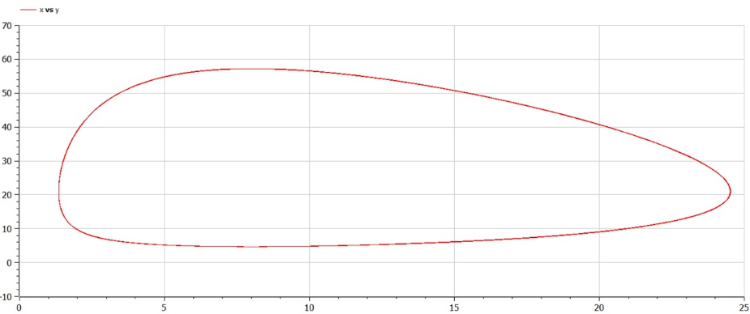
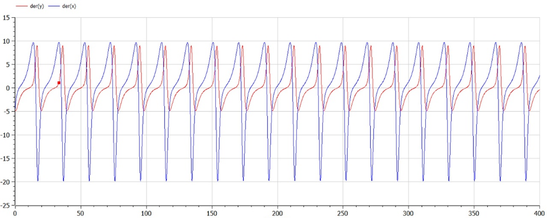

---
## Front matter
lang: ru-RU
title: Лабораторная работа №5
author: Асеева Яна Олеговна
documentclass: article
papersize: a4
toc: false
slide_level: 2
aspectratio: 20
section-titles: true
##Fonts
fontsize: 12pt
mainfont: PT Serif
romanfont: PT Serif
sansfont: PT Sans
monofont: PT Mono
mainfontoptions: Ligatures=TeX
romanfontoptions: Ligatures=TeX
sansfontoptions: Ligatures=TeX,Scale=MatchLowercase
monofontoptions: Scale=MatchLowercase,Scale=0.9
---

# 
Лабораторная работа №5

**Автор: Асеева Яна Олеговна**

**Группа: НКНбд-01-19**

## Прагматика выполнения

- Познакомиться с моделью Лотки-Вольтерры

- Научиться строить фазовый портрет системы с помощью OpenModelica

- Применение полученных знаний на практике в дальнейшем

  

## Цели

- Научиться работать с OpenModelica

- Построить график зависимости численности хищников от численности жертв

- Построить графики изменения численности хищников и численности жертв при заданных начальных условиях

- Найти стационарное состояние системы

- Получение новых знаний в ходе выполнения лабораторной работы

  

## Что такое модель Лотки-Вольтерры?

Модель Лотки-Вольтерры — модель взаимодействия двух видов типа «хищник — жертва», названная в честь её авторов, которые предложили модельные уравнения независимо друг от друга. Такие уравнения можно использовать для моделирования систем «хищник — жертва», «паразит — хозяин», конкуренции и других видов взаимодействия между двумя видами.

## Задание

Для модели «хищник-жертва»: 
$$
dx/dt=-0,32x(t)+0,04x(t)y(t);dy/dt=0,42y(t)-0,02x(t)y(t)
$$
Постройте график зависимости численности хищников от численности жертв, а также графики изменения численности хищников и численности жертв при следующих начальных условиях: 
$$
x_0=9,y_0=20
$$
Найдите стационарное состояние системы.

## Полученные графики

  

## Стационарное состояние системы 

  
  

 
## Результаты лабораторной работы

- Мы научились работать в OpenModelica

- Научились строить график зависимости численности хищников от численности жертв

- Научились строить графики изменения численности хищников и численности жертв при заданных начальных условиях 

- Научились находить стационарное состояние системы

  
  

    
  
    
  
    
  
    ### 
Спасибо за внимание!

