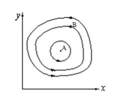
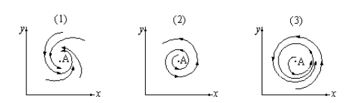
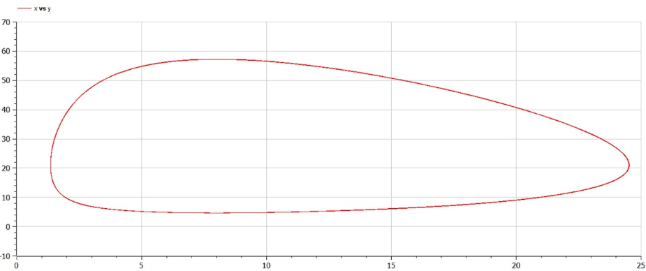
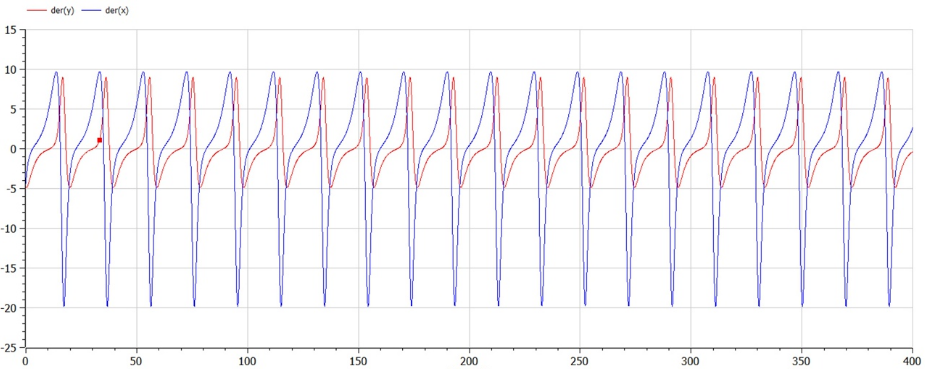

---
# Front matter
title: "Лабораторная работа №5"
subtitle: "Математическое моделирование"
author: Асеева Яна Олеговна

# Generic otions
lang: ru-RU
toc-title: Содержание

# Bibliography
bibliography: bib/cite.bib
csl: pandoc/csl/gost-r-7-0-5-2008-numeric.csl

# Pdf output format
toc: true # Table of contents
toc_depth: 2
lof: true # List of figures
lot: true # List of tables
fontsize: 12pt
linestretch: 1.5
papersize: a4
documentclass: scrreprt
## I18n
polyglossia-lang:
  name: russian
  options:
	- spelling=modern
	- babelshorthands=true
polyglossia-otherlangs:
  name: english
### Fonts
mainfont: PT Serif
romanfont: PT Serif
sansfont: PT Sans
monofont: PT Mono
mainfontoptions: Ligatures=TeX
romanfontoptions: Ligatures=TeX
sansfontoptions: Ligatures=TeX,Scale=MatchLowercase
monofontoptions: Scale=MatchLowercase,Scale=0.9
## Biblatex
biblatex: true
biblio-style: "gost-numeric"
biblatexoptions:
  - parentracker=true
  - backend=biber
  - hyperref=auto
  - language=auto
  - autolang=other*
  - citestyle=gost-numeric
## Misc options
indent: true
header-includes:
  - \linepenalty=10 # the penalty added to the badness of each line within a paragraph (no associated penalty node) Increasing the value makes tex try to have fewer lines in the paragraph.
  - \interlinepenalty=0 # value of the penalty (node) added after each line of a paragraph.
  - \hyphenpenalty=50 # the penalty for line breaking at an automatically inserted hyphen
  - \exhyphenpenalty=50 # the penalty for line breaking at an explicit hyphen
  - \binoppenalty=700 # the penalty for breaking a line at a binary operator
  - \relpenalty=500 # the penalty for breaking a line at a relation
  - \clubpenalty=150 # extra penalty for breaking after first line of a paragraph
  - \widowpenalty=150 # extra penalty for breaking before last line of a paragraph
  - \displaywidowpenalty=50 # extra penalty for breaking before last line before a display math
  - \brokenpenalty=100 # extra penalty for page breaking after a hyphenated line
  - \predisplaypenalty=10000 # penalty for breaking before a display
  - \postdisplaypenalty=0 # penalty for breaking after a display
  - \floatingpenalty = 20000 # penalty for splitting an insertion (can only be split footnote in standard LaTeX)
  - \raggedbottom # or \flushbottom
  - \usepackage{float} # keep figures where there are in the text
  - \floatplacement{figure}{H} # keep figures where there are in the text


---

# Цель работы                                                                                                 

Построить график зависимости численности хищников от численности жертв, а также графики изменения численности хищников и численности жертв при заданных начальных условиях. Найти стационарное состояние системы.

# Теоретическая справка

Модель Лотки-Вольтерры — модель взаимодействия двух видов типа «хищник — жертва», названная в честь её авторов, которые предложили модельные уравнения независимо друг от друга. Такие уравнения можно использовать для моделирования систем «хищник — жертва», «паразит — хозяин», конкуренции и других видов взаимодействия между двумя видами.

# Ход работы

**1. Постановка задачи**

Вариант 45. Для модели «хищник-жертва»: 
$$
dx/dt=-0,32x(t)+0,04x(t)y(t);dy/dt=0,42y(t)-0,02x(t)y(t)
$$
Постройте график зависимости численности хищников от численности жертв, а также графики изменения численности хищников и численности жертв при следующих начальных условиях: 
$$
x_0=9,y_0=20
$$
Найдите стационарное состояние системы.

**2. Решение**

Простейшая модель взаимодействия двух видов типа «хищник — жертва» - модель Лотки-Вольтерры. Данная двувидовая модель основывается на следующих предположениях:

1.Численность популяции жертв x и хищников y зависят только от времени (модель не учитывает пространственное распределение популяции на занимаемой территории) 

2.В отсутствии взаимодействия численность видов изменяется по модели Мальтуса, при этом число жертв увеличивается, а число хищников падает 

3.Естественная смертность жертвы и естественная рождаемость хищника считаются несущественными 

4.Эффект насыщения численности обеих популяций не учитывается 

5.Скорость роста численности жертв уменьшается пропорционально численности хищников
$$
dx/dt=ax(t)-bx(t)y(t);dy/dt=-cy(t)+dx(t)y(t)
$$
В этой модели x — число жертв, y — число хищников. Коэффициент a описывает скорость естественного прироста числа жертв в отсутствие хищников, с — естественное вымирание хищников, лишенных пищи в виде жертв. Вероятность взаимодействия жертвы и хищника считается пропорциональной как количеству жертв, так и числу самих хищников (xy). Каждый акт взаимодействия уменьшает популяцию жертв, но способствует увеличению популяции хищников (члены — bxy и dxy в правой части уравнения). 

 

(рис.1)

Математический анализ этой (жесткой) модели показывает, что имеется стационарное состояние (A на рис.1), всякое же другое начальное состояние (B) приводит к периодическому колебанию численности как жертв, так и хищников, так что по прошествии некоторого времени система возвращается в состояние B. 

Стационарное состояние системы (положение равновесия, не зависящее от времени решение) будет в точке: 
$$
x_0=c/d;y_0=a/b
$$
Если начальные значения задать в стационарном состоянии  
$$
x(0)=x_0,y(0)=y_0
$$
то в любой момент времени численность популяций изменяться не будет. При малом отклонении от положения равновесия численности как хищника, так и жертвы с течением времени не возвращаются к равновесным значениям, а совершают периодические колебания вокруг стационарной точки. Амплитуда колебаний и их период определяется начальными значениями численностей x(0), y(0). Колебания совершаются в противофазе.

При малом изменении модели 
$$
dx/dt=ax(t)-bx(t)y(t)+\varepsilon f(x,y);dy/dt=-cy(t)+dx(t)y(t)+\varepsilon g(x,y),\varepsilon \ll1
$$
(прибавление к правым частям малые члены, учитывающие, например, конкуренцию жертв за пищу и хищников за жертв), вывод о периодичности (возвращении системы в исходное состояние B), справедливый для жесткой системы Лотки-Вольтерры, теряет силу. Таким образом, мы получаем так называемую мягкую модель «хищник-жертва». В зависимости от вида малых поправок f и g возможны следующие сценарии 1-3 (рис.2).



(рис.2)

В случае 1 равновесное состояние A устойчиво. При любых других начальных условиях через большое время устанавливается именно оно. 

В случае 2 система стационарное состояние неустойчиво. Эволюция приводит то к резкому увеличению числа хищников, то к их почти полному вымиранию. Такая система в конце концов попадает в область столь больших или столь малых значений x и y, что модель перестает быть применимой. 

В случае 3 в системе с неустойчивым стационарным состоянием A с течением времени устанавливается периодический режим. В отличие от исходной жесткой модели Лотки-Вольтерры, в этой модели установившийся периодический режим не зависит от начального условия. Первоначально незначительное отклонение от стационарного состояния A приводит не к малым колебаниям около A, как в модели Лотки-Вольтерры, а к колебаниям вполне определенной (и не зависящей от малости отклонения) амплитуды. Возможны и другие структурно устойчивые сценарии (например, с несколькими периодическими режимами).

Вывод: жесткую модель всегда надлежит исследовать на структурную устойчивость полученных при ее изучении результатов по отношению к малым изменениям модели (делающим ее мягкой). 

В случае модели Лотки-Вольтерры для суждения о том, какой же из сценариев 1-3 (или иных возможных) реализуется в данной системе, совершенно необходима дополнительная информация о системе (о виде малых поправок f и g в нашей формуле). Математическая теория мягких моделей указывает, какую именно информацию для этого нужно иметь. Без этой информации жесткая модель может привести к качественно ошибочным предсказаниям. Доверять выводам, сделанным на основании жесткой модели, можно лишь тогда, когда они подтверждаются исследованием их структурной устойчивости.

**3. Код программы**

```
model lab5

constant Real a=0.32;//значение a
constant Real b=0.04;//значение b
constant Real c=0.42;//значение c
constant Real d=0.02;//значение d

Real x;//хищники 
Real y;//жертвы 

initial equation
x=9;//начальное количество хищников
y=20;//начальное количество жертв

equation
der(x)=a*x-b*x*y;//уравнение системы 
der(y)=-c*y+d*x*y;//уравнение системы

end lab5;
```

Получили следующие графики (рис.3) и (рис.4):



(рис.3)



(рис.4)

Найдем стационарное состояние системы:
$$
x_0=0,42/0,02=21;y_0=0,32/0,04=8
$$


# Вывод

В ходе выполнения лабораторной работы я научилась строить график зависимости численности хищников от численности жертв, а также графики изменения численности хищников и численности жертв при заданных начальных условиях. Нашла стационарное состояние системы.

# Список литературы

Кулябов Д. С.  Лабораторная работа №5: https://esystem.rudn.ru/mod/resource/view.php?id=831045
