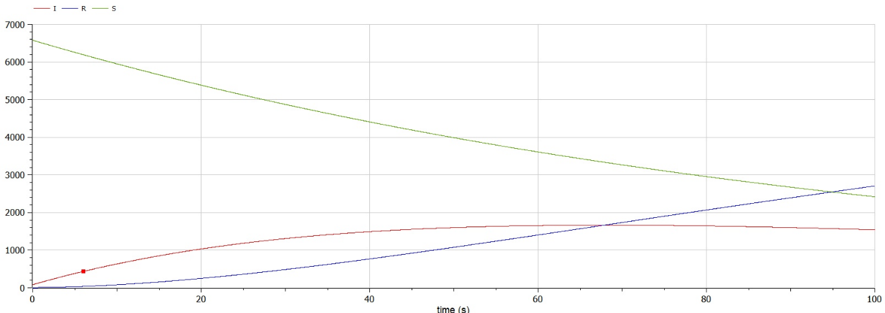
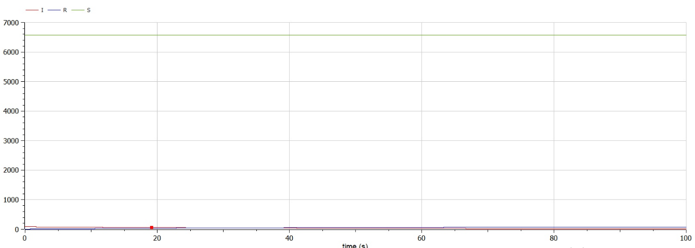

---
## Front matter
lang: ru-RU
title: Лабораторная работа №6
author: Асеева Яна Олеговна
documentclass: article
papersize: a4
toc: false
slide_level: 2
aspectratio: 20
section-titles: true
##Fonts
fontsize: 12pt
mainfont: PT Serif
romanfont: PT Serif
sansfont: PT Sans
monofont: PT Mono
mainfontoptions: Ligatures=TeX
romanfontoptions: Ligatures=TeX
sansfontoptions: Ligatures=TeX,Scale=MatchLowercase
monofontoptions: Scale=MatchLowercase,Scale=0.9
---

# 
Лабораторная работа №6

**Автор: Асеева Яна Олеговна**

**Группа: НКНбд-01-19**

## Прагматика выполнения

- Познакомиться с простейшей моделью эпидемии

- Научиться строить графики изменения числа особей в группах с помощью OpenModelica

- Применение полученных знаний на практике в дальнейшем

  

## Цели

- Научиться работать с OpenModelica

- Построить графики изменения числа особей в группах с помощью простейшей модели эпидемии

- Рассмотреть, как будет протекать эпидемия в различных случаях

- Получение новых знаний в ходе выполнения лабораторной работы

  

## Что такое простейшая модель эпидемии?

Предположим, что некая популяция, состоящая из N особей, (считаем, что популяция изолирована) подразделяется на три группы. Первая группа - это восприимчивые к болезни, но пока здоровые особи, обозначим их через S(t). Вторая группа – это число инфицированных особей, которые также при этом являются распространителями инфекции, обозначим их I(t). А третья группа, обозначающаяся через R(t) – это здоровые особи с иммунитетом к болезни.

## Задание

На одном острове вспыхнула эпидемия. Известно, что из всех проживающих на острове (N=6666) в момент начала эпидемии (t=0) число заболевших людей (являющихся распространителями инфекции) I(0)=83, а число здоровых людей с иммунитетом к болезни R(0)=6. Таким образом, число людей восприимчивых к болезни, но пока здоровых, в начальный момент времени S(0)=N-I(0)-R(0). Постройте графики изменения числа особей в каждой из трех групп. Рассмотрите, как будет протекать эпидемия в случае, если: 
$$
1) I(0)>I^*
$$

$$
2)I(0)\leq I^*
$$

## Полученные графики для случая 1

  

## Полученные графики для случая 2

  

## Результаты лабораторной работы

- Мы научились работать в OpenModelica

- Научились строить графики изменения числа особей в группах с помощью простейшей модели эпидемии

- Рассмотрели, как будет протекать эпидемия в различных случаях

  

    

    

    

    ### 
Спасибо за внимание!

