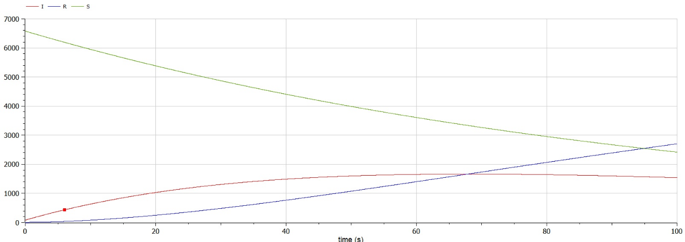
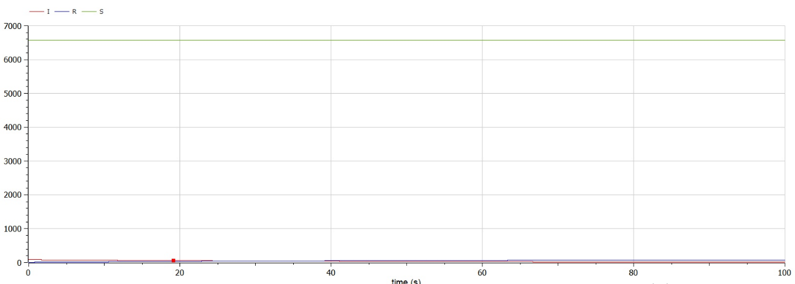

---
# Front matter
title: "Лабораторная работа №6"
subtitle: "Математическое моделирование"
author: Асеева Яна Олеговна

# Generic otions
lang: ru-RU
toc-title: Содержание

# Bibliography
bibliography: bib/cite.bib
csl: pandoc/csl/gost-r-7-0-5-2008-numeric.csl

# Pdf output format
toc: true # Table of contents
toc_depth: 2
lof: true # List of figures
lot: true # List of tables
fontsize: 12pt
linestretch: 1.5
papersize: a4
documentclass: scrreprt
## I18n
polyglossia-lang:
  name: russian
  options:
	- spelling=modern
	- babelshorthands=true
polyglossia-otherlangs:
  name: english
### Fonts
mainfont: PT Serif
romanfont: PT Serif
sansfont: PT Sans
monofont: PT Mono
mainfontoptions: Ligatures=TeX
romanfontoptions: Ligatures=TeX
sansfontoptions: Ligatures=TeX,Scale=MatchLowercase
monofontoptions: Scale=MatchLowercase,Scale=0.9
## Biblatex
biblatex: true
biblio-style: "gost-numeric"
biblatexoptions:
  - parentracker=true
  - backend=biber
  - hyperref=auto
  - language=auto
  - autolang=other*
  - citestyle=gost-numeric
## Misc options
indent: true
header-includes:
  - \linepenalty=10 # the penalty added to the badness of each line within a paragraph (no associated penalty node) Increasing the value makes tex try to have fewer lines in the paragraph.
  - \interlinepenalty=0 # value of the penalty (node) added after each line of a paragraph.
  - \hyphenpenalty=50 # the penalty for line breaking at an automatically inserted hyphen
  - \exhyphenpenalty=50 # the penalty for line breaking at an explicit hyphen
  - \binoppenalty=700 # the penalty for breaking a line at a binary operator
  - \relpenalty=500 # the penalty for breaking a line at a relation
  - \clubpenalty=150 # extra penalty for breaking after first line of a paragraph
  - \widowpenalty=150 # extra penalty for breaking before last line of a paragraph
  - \displaywidowpenalty=50 # extra penalty for breaking before last line before a display math
  - \brokenpenalty=100 # extra penalty for page breaking after a hyphenated line
  - \predisplaypenalty=10000 # penalty for breaking before a display
  - \postdisplaypenalty=0 # penalty for breaking after a display
  - \floatingpenalty = 20000 # penalty for splitting an insertion (can only be split footnote in standard LaTeX)
  - \raggedbottom # or \flushbottom
  - \usepackage{float} # keep figures where there are in the text
  - \floatplacement{figure}{H} # keep figures where there are in the text
---

# Цель работы                                                                                                 

Построить графики изменения числа особей в группах с помощью простейшей модели эпидемии, рассмотреть, как будет протекать эпидемия в различных случаях. 

# Теоретическая справка

Предположим, что некая популяция, состоящая из N особей, (считаем, что популяция изолирована) подразделяется на три группы. Первая группа - это восприимчивые к болезни, но пока здоровые особи, обозначим их через S(t). Вторая группа – это число инфицированных особей, которые также при этом являются распространителями инфекции, обозначим их I(t). А третья группа, обозначающаяся через R(t) – это здоровые особи с иммунитетом к болезни. 

До того, как число заболевших не превышает критического значения I* , считаем, что все больные изолированы и не заражают здоровых. Когда I(t)>I*, тогда инфицирование способны заражать восприимчивых к болезни особей. Таким образом, скорость изменения числа S(t) меняется по следующему закону:
$$
\frac{\partial S}{\partial t}=\begin{cases}-\alpha S,если\ I(t)>I^*;\ 0, если\ I(t)\leq I^*\end{cases}
$$
Поскольку каждая восприимчивая к болезни особь, которая, в конце концов, заболевает, сама становится инфекционной, то скорость изменения числа инфекционных особей представляет разность за единицу времени между заразившимися и теми, кто уже болеет и лечится, т.е.: 
$$
\frac{\partial I}{\partial t}=\begin{cases}\alpha S-\beta I,если\ I(t)>I^*;\ -\beta I,если\ I(t)\leq I^*\end{cases}
$$
А скорость изменения выздоравливающих особей (при этом приобретающие иммунитет к болезни): 
$$
\frac{\partial R}{\partial t}=\beta I 
$$
Постоянные пропорциональности
$$
\alpha,\beta
$$
это коэффициенты заболеваемости и выздоровления соответственно.

Для того, чтобы решения соответствующих уравнений определялось однозначно, необходимо задать начальные условия .Считаем, что на начало эпидемии в момент времени t=0 нет особей с иммунитетом к болезни R(0)=0, а число инфицированных и восприимчивых к болезни особей I(0) и S(0) соответственно. Для анализа картины протекания эпидемии необходимо рассмотреть два случая: 
$$
I(0)>I^*;I(0)\leq I^*
$$


# Ход работы

**1. Постановка задачи**

Вариант 45. На одном острове вспыхнула эпидемия. Известно, что из всех проживающих на острове (N=6666) в момент начала эпидемии (t=0) число заболевших людей (являющихся распространителями инфекции) I(0)=83, а число здоровых людей с иммунитетом к болезни R(0)=6. Таким образом, число людей восприимчивых к болезни, но пока здоровых, в начальный момент времени S(0)=N-I(0)-R(0). Постройте графики изменения числа особей в каждой из трех групп. Рассмотрите, как будет протекать эпидемия в случае, если: 
$$
1) I(0)>I^*
$$

$$
2)I(0)\leq I^*
$$

**2. Решение для случая 1**

```
model sluchay1 
constant Real a=0.01;//коэффицент заболевания
constant Real b=0.02;//коэфицент выздоровления 
constant Real N=6666;//количество проживающих на острове

Real I;//инфицированные особи
Real R;//здоровые особи с иммунитетом к болезни 
Real S;//здоровые особи, восприимчивые к болезни

initial equation 
I=83;//количество инфицированных особей
R=6;//количество здоровых особей с иммунитетом к болезни 
S=N-I-R;//количество здоровых особей, восприимчивых к болезни

equation 
der(S)=-a*S;//изменение количества здоровых особей, восприимчивых к болезни
der(I)=a*S-b*I;//изменение количества инфицированных особей
der(R)=b*I;//изменение количества здоровых особей с иммунитетом 

end sluchay1
```

Для случая 1 получили следующие графики (рис.1):



рис.1

**3. Решение для случая 2**

```
model sluchay2 
constant Real b=0.02;//коэфицент выздоровления 
constant Real N=6666;//количество проживающих на острове

Real I;//инфицированные особи
Real R;//здоровые особи с иммунитетом к болезни 
Real S;//здоровые особи, восприимчивые к болезни

initial equation 
I=83;//количество инфицированных особей
R=6;//количество здоровых особей с иммунитетом к болезни 
S=N-I-R;//количество здоровых особей, восприимчивых к болезни

equation 
der(S)=0;//изменение количества здоровых особей, восприимчивых к болезни 
der(I)=-b*I;//изменение количества инфицированных особей
der(R)=b*I;//изменение количества здоровых особей с иммунитетом 

end sluchay2
```

Для случая 2 получили следующие графики (рис.2):



рис.2

# Вывод

В ходе выполнения лабораторной работы я научилась строить графики изменения числа особей в группах с помощью простейшей модели эпидемии, рассмотрела, как будет протекать эпидемия в различных случаях. 

# Список литературы

Кулябов Д. С.  Лабораторная работа №6: https://esystem.rudn.ru/mod/resource/view.php?id=831049
