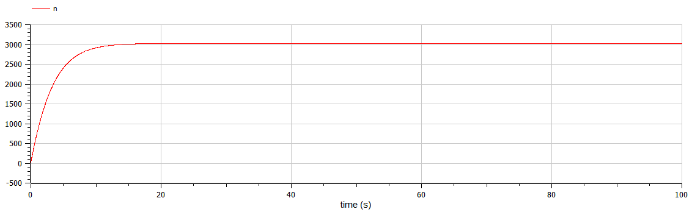
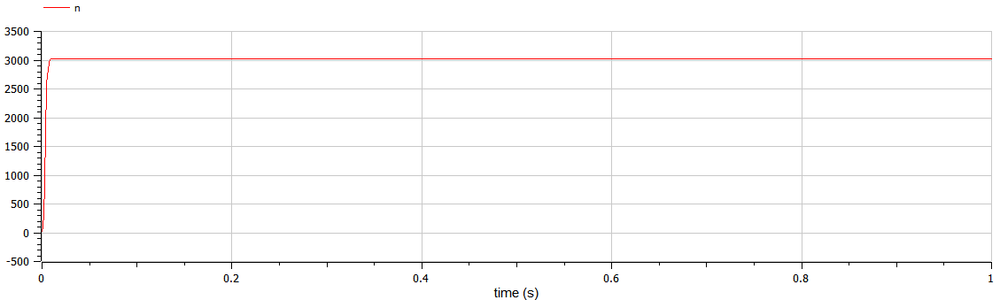
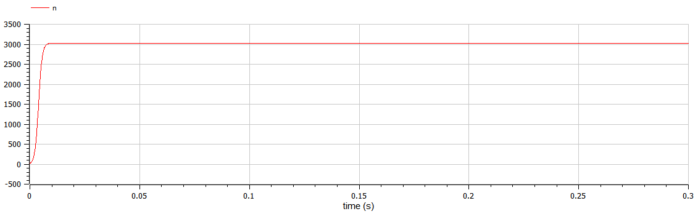

---
## Front matter
lang: ru-RU
title: Лабораторная работа №7
author: Асеева Яна Олеговна
documentclass: article
papersize: a4
toc: false
slide_level: 2
aspectratio: 20
section-titles: true
##Fonts
fontsize: 12pt
mainfont: PT Serif
romanfont: PT Serif
sansfont: PT Sans
monofont: PT Mono
mainfontoptions: Ligatures=TeX
romanfontoptions: Ligatures=TeX
sansfontoptions: Ligatures=TeX,Scale=MatchLowercase
monofontoptions: Scale=MatchLowercase,Scale=0.9
---

# 
Лабораторная работа №7

**Автор: Асеева Яна Олеговна**

**Группа: НКНбд-01-19**

## Прагматика выполнения

- Познакомиться с простейшей моделью эффективности рекламы

- Научиться строить графики распространения рекламы с помощью OpenModelica

- Применение полученных знаний на практике в дальнейшем

  

## Цели

- Научиться работать с OpenModelica
- Построение решения распространения информации о товаре, учитывая вклад платной рекламы
- Построение решения распространения информации о товаре, учитывая вклад «сарафанного радио» 
- Построение решения распространения информации о товаре, учитывая вклад платной рекламы и «сарафанного радио» 

- Научиться определять в какой момент времени скорость распространения рекламы будет иметь максимальное значение

- Получение новых знаний в ходе выполнения лабораторной работы

  

## Что такое простейшая модель эффективности рекламы?

Предположим, что торговыми учреждениями реализуется некоторая продукция, о которой в момент времени t из числа потенциальных покупателей N знает лишь n покупателей. Для ускорения сбыта продукции запускается реклама по радио, телевидению и других средств массовой информации. После запуска рекламной кампании информация о продукции начнет распространяться среди потенциальных покупателей путем общения друг с другом. Таким образом, после запуска рекламных объявлений скорость изменения числа знающих о продукции людей пропорциональна как числу знающих о товаре покупателей, так и числу покупателей о нем не знающих.

## Задание

Вариант 45. Постройте график распространения рекламы, математическая модель которой описывается следующим уравнением:
$$
\frac{\partial n}{\partial t}=(0.288+0.000018n(t))(N-n(t))
$$

$$
\frac{\partial n}{\partial t}=(0.000018+0.377n(t))(N-n(t))
$$

$$
\frac{\partial n}{\partial t}=(0.1t+0.4cos(t)n(t))(N-n(t))
$$

При этом объем аудитории N=3030 , в начальный момент о товаре знает 24 человек. Для случая 2 определите в какой момент времени скорость распространения рекламы будет иметь максимальное значение.

## Полученный график для случая 1

  

## Полученный график для случая 2

  

## Полученный график для случая 3

  

## Результаты лабораторной работы

- Мы научились работать в OpenModelica

- Научились строить графики распространения рекламы

- Научились определять в какой момент времени скорость распространения рекламы будет иметь максимальное значение

  

    

    

    

    ### 
Спасибо за внимание!

