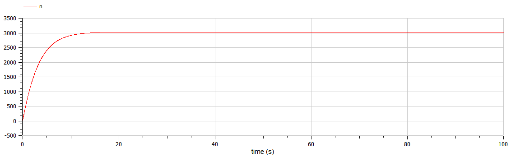
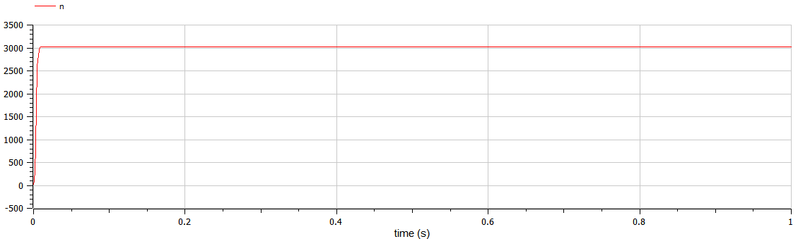
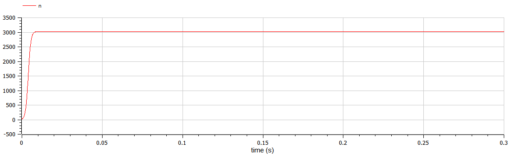
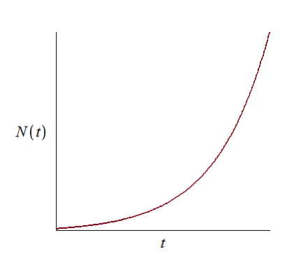
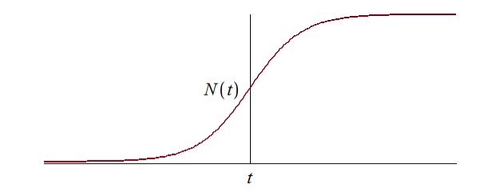

---
# Front matter
title: "Лабораторная работа №7"
subtitle: "Математическое моделирование"
author: Асеева Яна Олеговна

# Generic otions
lang: ru-RU
toc-title: Содержание

# Bibliography
bibliography: bib/cite.bib
csl: pandoc/csl/gost-r-7-0-5-2008-numeric.csl

# Pdf output format
toc: true # Table of contents
toc_depth: 2
lof: true # List of figures
lot: true # List of tables
fontsize: 12pt
linestretch: 1.5
papersize: a4
documentclass: scrreprt
## I18n
polyglossia-lang:
  name: russian
  options:
	- spelling=modern
	- babelshorthands=true
polyglossia-otherlangs:
  name: english
### Fonts
mainfont: PT Serif
romanfont: PT Serif
sansfont: PT Sans
monofont: PT Mono
mainfontoptions: Ligatures=TeX
romanfontoptions: Ligatures=TeX
sansfontoptions: Ligatures=TeX,Scale=MatchLowercase
monofontoptions: Scale=MatchLowercase,Scale=0.9
## Biblatex
biblatex: true
biblio-style: "gost-numeric"
biblatexoptions:
  - parentracker=true
  - backend=biber
  - hyperref=auto
  - language=auto
  - autolang=other*
  - citestyle=gost-numeric
## Misc options
indent: true
header-includes:
  - \linepenalty=10 # the penalty added to the badness of each line within a paragraph (no associated penalty node) Increasing the value makes tex try to have fewer lines in the paragraph.
  - \interlinepenalty=0 # value of the penalty (node) added after each line of a paragraph.
  - \hyphenpenalty=50 # the penalty for line breaking at an automatically inserted hyphen
  - \exhyphenpenalty=50 # the penalty for line breaking at an explicit hyphen
  - \binoppenalty=700 # the penalty for breaking a line at a binary operator
  - \relpenalty=500 # the penalty for breaking a line at a relation
  - \clubpenalty=150 # extra penalty for breaking after first line of a paragraph
  - \widowpenalty=150 # extra penalty for breaking before last line of a paragraph
  - \displaywidowpenalty=50 # extra penalty for breaking before last line before a display math
  - \brokenpenalty=100 # extra penalty for page breaking after a hyphenated line
  - \predisplaypenalty=10000 # penalty for breaking before a display
  - \postdisplaypenalty=0 # penalty for breaking after a display
  - \floatingpenalty = 20000 # penalty for splitting an insertion (can only be split footnote in standard LaTeX)
  - \raggedbottom # or \flushbottom
  - \usepackage{float} # keep figures where there are in the text
  - \floatplacement{figure}{H} # keep figures where there are in the text
---

# Цель работы                                                                                                 

Построить графики распространения рекламы, определить в какой момент времени скорость распространения рекламы будет иметь максимальное значение.

# Теоретическая справка

Организуется рекламная кампания нового товара или услуги. Необходимо, чтобы прибыль будущих продаж с избытком покрывала издержки на рекламу. Вначале расходы могут превышать прибыль, поскольку лишь малая часть потенциальных покупателей будет информирована о новинке. Затем, при увеличении числа продаж, возрастает и прибыль, и, наконец, наступит момент, когда рынок насытиться, и рекламировать товар станет бесполезным.

Предположим, что торговыми учреждениями реализуется некоторая продукция, о которой в момент времени t из числа потенциальных покупателей N знает лишь n покупателей. Для ускорения сбыта продукции запускается реклама по радио, телевидению и других средств массовой информации. После запуска рекламной кампании информация о продукции начнет распространяться среди потенциальных покупателей путем общения друг с другом. Таким образом, после запуска рекламных объявлений скорость изменения числа знающих о продукции людей пропорциональна как числу знающих о товаре покупателей, так и числу покупателей о нем незнающих. 

Модель рекламной кампании описывается следующими величинами. Считаем, что dn/dt - скорость изменения со временем числа потребителей, узнавших о товаре и готовых его купить, t - время, прошедшее с начала рекламной кампании, n(t) - число уже информированных клиентов. Эта величина пропорциональна числу покупателей, еще не знающих о нем, это описывается следующим образом:
$$
\alpha_1(t)(N-n(t))
$$
где N - общее число потенциальных платежеспособных покупателей,
$$
\alpha_1(t)>0
$$
характеризует интенсивность рекламной кампании (зависит от затрат на рекламу в данный момент времени). Помимо этого, узнавшие о товаре потребители также распространяют полученную информацию среди потенциальных покупателей, не знающих о нем (в этом случае работает т.н. сарафанное радио). Этот вклад в рекламу описывается величиной 
$$
\alpha_2(t)n(t)(N-n(t))
$$
эта величина увеличивается с увеличением потребителей узнавших о товаре. Математическая модель распространения рекламы описывается уравнением:
$$
\frac{\partial n}{\partial t}=(\alpha_1(t)+\alpha_2(t)n(t))(N-n(t))
$$


# Ход работы

**1. Постановка задачи**

Вариант 45. Постройте график распространения рекламы, математическая модель которой описывается следующим уравнением:
$$
\frac{\partial n}{\partial t}=(0.288+0.000018n(t))(N-n(t))
$$

$$
\frac{\partial n}{\partial t}=(0.000018+0.377n(t))(N-n(t))
$$

$$
\frac{\partial n}{\partial t}=(0.1t+0.4cos(t)n(t))(N-n(t))
$$

При этом объем аудитории N=3030 , в начальный момент о товаре знает 24 человек. Для случая 2 определите в какой момент времени скорость распространения рекламы будет иметь максимальное значение.

**2. Решение для случая 1**
$$
\alpha_1(t)>>\alpha_2(t)
$$


```
model sluch1

constant Real a1=0.288;//значение коэффициента a1
constant Real a2=0.000018;//значение коэффициента a2
constant Real N=3030;//объем аудитории

Real n;//количество человек, которые знают о товаре 

initial equation 
n=24;//количество человек, которые знают о товаре в начальный момент времени

equation 
der(n)=(a1+a2*n)*(N-n);//уравнение

end sluch1;
```

Для случая 1 получили следующий график (рис.1):



рис.1

**3. Решение для случая 2**
$$
\alpha_1(t)<<\alpha_2(t)
$$

```
model sluch2

constant Real a1=0.000018;//значение коэффициента a1
constant Real a2=0.377;//значение коэффициента a2
constant Real N=3030;//объем аудитории

Real n;//количество человек, которые знают о товаре 

initial equation 
n=24;//количество человек, которые знают о товаре в начальный момент времени

equation 
der(n)=(a1+a2*n)*(N-n);//уравнение 

end sluch2;
```

Для случая 2 получили следующий график (рис.2):



рис.2

Максимальное значение n достигается при time=0.016.

**4. Решение для случая 3**
$$
\alpha_1(t)≈\alpha_2(t)
$$

```
model sluch3

constant Real N=3030;//объем аудитории

Real a1;//коэффициент a1
Real a2;//коэффициент a2
Real n;//количество человек, которые знают о товаре 

initial equation 
n=24;//количество человек, которые знают о товаре в начальный момент времени

equation 
a1=0.1*time; 
a2=0.4*cos(time);
der(n)=(a1+a2*n)*(N-n);

end sluch3;
```

Для случая 3 получили следующий график (рис.3):



рис.3

# Вопросы к лабораторной работе

1.Записать модель Мальтуса (дать пояснение, где используется данная модель).
$$
\frac{\partial N}{\partial t}=rN
$$
где N — исходная численность населения, r — коэффициент пропорциональности, для которого r = b - d (b — коэффициент рождаемости, d — коэффициент смертности), t — время.

Модель используется в экологии для расчета изменения популяции особей животных.

2.Записать уравнение логистической кривой (дать пояснение, что описывает данное уравнение). 
$$
\frac{\partial P}{\partial t}=rP(1-\frac{P}{K})
$$
где r — характеризует скорость роста (размножения), K — поддерживающая ёмкость среды (то есть, максимально возможная численность популяции).

Исходные предположения для вывода уравнения при рассмотрении популяционной динамики выглядят следующим образом:

скорость размножения популяции пропорциональна её текущей численности, при прочих равных условиях;

скорость размножения популяции пропорциональна количеству доступных ресурсов, при прочих равных условиях. Таким образом, второй член уравнения отражает конкуренцию за ресурсы, которая ограничивает рост популяции.

3.На что влияет коэффициенты
$$
\alpha_1(t);\alpha_2(t)
$$
в модели распространения рекламы.
$$
\alpha_1(t)
$$
— интенсивность рекламной кампании, зависящая от затрат.
$$
\alpha_2(t)
$$
— интенсивность рекламной кампании, зависящая от сарафанного радио.

4.Как ведет себя рассматриваемая модель при
$$
\alpha_1(t)>>\alpha_2(t)
$$
При данный условиях получается модель типа модели Мальтуса, решение которой имеет вид (рис.4):



рис.4

5.Как ведет себя рассматриваемая модель при 
$$
\alpha_1(t)<<\alpha_2(t)
$$
При данных условиях получаем уравнение логистической кривой (рис.5):



рис.5

# Вывод

В ходе выполнения лабораторной работы я научилась строить графики распространения рекламы, определять в какой момент времени скорость распространения рекламы будет иметь максимальное значение.

# Список литературы

Кулябов Д. С.  Лабораторная работа №7: https://esystem.rudn.ru/mod/resource/view.php?id=831053
