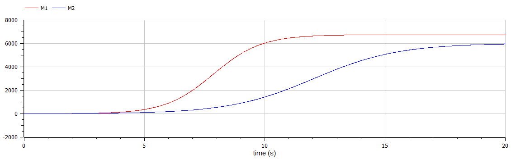
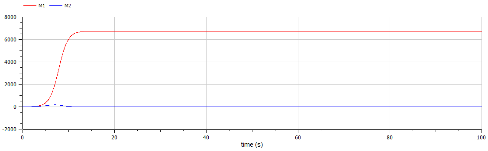

---
## Front matter
lang: ru-RU
title: Лабораторная работа №8
author: Асеева Яна Олеговна
documentclass: article
papersize: a4
toc: false
slide_level: 2
aspectratio: 20
section-titles: true
##Fonts
fontsize: 12pt
mainfont: PT Serif
romanfont: PT Serif
sansfont: PT Sans
monofont: PT Mono
mainfontoptions: Ligatures=TeX
romanfontoptions: Ligatures=TeX
sansfontoptions: Ligatures=TeX,Scale=MatchLowercase
monofontoptions: Scale=MatchLowercase,Scale=0.9
---

# 
Лабораторная работа №8

**Автор: Асеева Яна Олеговна**

**Группа: НКНбд-01-19**

## Прагматика выполнения

- Рассмотреть модель конкуренции двух фирм

- Научиться строить графики изменения оборотных средств с помощью OpenModelica

- Применение полученных знаний на практике в дальнейшем

  

## Цели

- Рассмотреть две фирмы, производящие взаимозаменяемые товары одинакового качества и находящиеся в одной рыночной нише

- Рассмотреть модель, когда, помимо экономического фактора влияния, используются еще и социально-психологические факторы – формирование общественного предпочтения одного товара другому, не зависимо от их качества и цены

- Построить графики изменения оборотных средств фирмы 1 и фирмы 2 без учета постоянных издержек и с веденной нормировкой для случая 1

- Построить графики изменения оборотных средств фирмы 1 и фирмы 2 без учета постоянных издержек и с веденной нормировкой для случая 2

- Получение новых знаний в ходе выполнения лабораторной работы

  

## Задание

**Случай 1.**  Рассмотрим две фирмы, производящие взаимозаменяемые товары одинакового качества и находящиеся в одной рыночной нише. Считаем, что в рамках нашей модели конкурентная борьба ведётся только рыночными методами. То есть, конкуренты могут влиять на противника путем изменения параметров своего производства: себестоимость, время цикла, но не могут прямо вмешиваться в ситуацию на рынке («назначать» цену или влиять на потребителей каким-либо иным способом.) Будем считать, что постоянные издержки пренебрежимо малы, и в модели учитывать не будем. В этом случае динамика изменения объемов продаж фирмы 1 и фирмы 2 описывается следующей системой уравнений: 
$$
\frac{\partial M_1}{\partial\theta}=M_1-\frac{b}{c_1}M_1M_2-\frac{a_1}{c_1}M_1^2;\frac{\partial M_2}{\partial\theta}=\frac{c_2}{c_1}M_2-\frac{b}{c_1}M_1M_2- \frac{a_2}{c_1}M_2^2
$$
где 
$$
a_1=\frac{p_{cr}}{\tau_1^2\tilde{p}_1^2Nq},a_2=\frac{p_{cr}}{\tau_2^2\tilde{p}_2^2Nq},b=\frac{p_{cr}}{\tau_1^2\tilde{p}_1^2\tau_2^2\tilde{p}_2^2Nq},c_1=\frac{p_{cr}-\tilde{p}_1}{\tau_1\tilde{p}_1},c_2=\frac{p_{cr}-\tilde{p}_2}{\tau_2\tilde{p}_2}
$$
Также введена нормировка 
$$
t=c_1\theta
$$

## Задание

**Случай 2.** Рассмотрим модель, когда, помимо экономического фактора влияния (изменение себестоимости, производственного цикла, использование кредита и т.п.), используются еще и социально-психологические факторы – формирование общественного предпочтения одного товара другому, не зависимо от их качества и цены. В этом случае взаимодействие двух фирм будет зависеть друг от друга, соответственно коэффициент перед 
$$
M_1M_2
$$
будет отличаться. Пусть в  рамках рассматриваемой модели динамика изменения объемов продаж фирмы 1 и фирмы 2 описывается следующей системой уравнений:
$$
\frac{\partial M_1}{\partial \theta}=M_1-\frac{b}{c_1}M_1M_2-\frac{a_1}{c_1}M_1^2;\frac{\partial M_2}{\partial\theta}=\frac{c_2}{c_1}M_2-(\frac{b}{c_1}+0.00026)M_1M_2-\frac{a_2}{c_1}M_2^2
$$
Для обоих случаев рассмотрим задачу со следующими начальными условиями и параметрами: 
$$
M_0^1=2.6,M_0^2=6.2,p_{cr}=40,N=43,q=1,\tau_1=20,\tau_2=14,\tilde{p}_1=10.7,\tilde{p}_2=19.1
$$

## Задание
**Обозначения:**
$$
N
$$
– число потребителей производимого продукта
$$
\tau
$$
– длительность производственного цикла
$$
p
$$
– рыночная цена товара
$$
\tilde{p}
$$
– себестоимость продукта, то есть переменные издержки на производство единицы продукции
$$
q
$$
– максимальная потребность одного человека в продукте в единицу времени
$$
\theta=\frac{t}{c_1}
$$
– безразмерное время

## Задание
1.Постройте графики изменения оборотных средств фирмы 1 и фирмы 2 без учета постоянных издержек и с веденной нормировкой для случая 1

2.Постройте графики изменения оборотных средств фирмы 1 и фирмы 2 без учета постоянных издержек и с веденной нормировкой для случая 2

## Полученный график для случая 1

По графику видно, что рост оборотных средств предприятий идет независимо друг от друга. Каждая фирма достигает свое максимальное значение объема продаж и остается на рынке с этим значением, то есть каждая фирма захватывает свою часть рынка потребителей, которая не изменяется. 

  

## Полученный график для случая 2

По графику видно, что фирма M2, несмотря на начальный рост, достигнув своего максимального объема продаж, начитает нести убытки и, в итоге, терпит банкротство. Динамика роста объемов оборотных средств фирмы M1 остается без изменения: достигнув максимального значения, остается на этом уровне.

  

## Результаты лабораторной работы

- Мы научились работать в OpenModelica

- Рассмотрели модель конкуренции двух фирм в разных случаях

-  Построили графики изменения оборотных средств и проанализировали их

  

    

    

    

    ### 
Спасибо за внимание!

