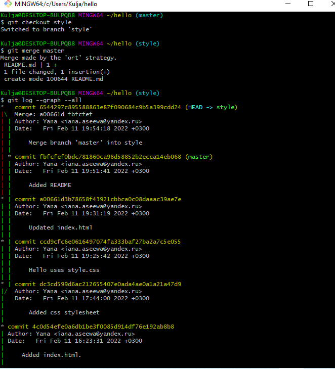
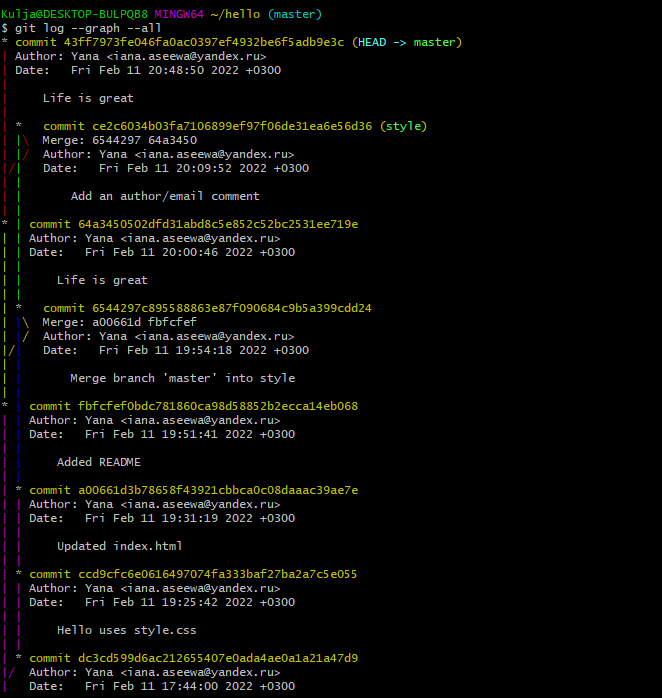

---
# Front matter
title: "Лабораторная работа №1"
subtitle: "Математическое моделирование"
author: "Асеева Яна Олеговна"

# Generic otions
lang: ru-RU
toc-title: "Содержание"

# Bibliography
bibliography: bib/cite.bib
csl: pandoc/csl/gost-r-7-0-5-2008-numeric.csl

# Pdf output format
toc: true # Table of contents
toc_depth: 2
lof: true # List of figures
lot: true # List of tables
fontsize: 12pt
linestretch: 1.5
papersize: a4
documentclass: scrreprt
## I18n
polyglossia-lang:
  name: russian
  options:
	- spelling=modern
	- babelshorthands=true
polyglossia-otherlangs:
  name: english
### Fonts
mainfont: PT Serif
romanfont: PT Serif
sansfont: PT Sans
monofont: PT Mono
mainfontoptions: Ligatures=TeX
romanfontoptions: Ligatures=TeX
sansfontoptions: Ligatures=TeX,Scale=MatchLowercase
monofontoptions: Scale=MatchLowercase,Scale=0.9
## Biblatex
biblatex: true
biblio-style: "gost-numeric"
biblatexoptions:
  - parentracker=true
  - backend=biber
  - hyperref=auto
  - language=auto
  - autolang=other*
  - citestyle=gost-numeric
## Misc options
indent: true
header-includes:
  - \linepenalty=10 # the penalty added to the badness of each line within a paragraph (no associated penalty node) Increasing the value makes tex try to have fewer lines in the paragraph.
  - \interlinepenalty=0 # value of the penalty (node) added after each line of a paragraph.
  - \hyphenpenalty=50 # the penalty for line breaking at an automatically inserted hyphen
  - \exhyphenpenalty=50 # the penalty for line breaking at an explicit hyphen
  - \binoppenalty=700 # the penalty for breaking a line at a binary operator
  - \relpenalty=500 # the penalty for breaking a line at a relation
  - \clubpenalty=150 # extra penalty for breaking after first line of a paragraph
  - \widowpenalty=150 # extra penalty for breaking before last line of a paragraph
  - \displaywidowpenalty=50 # extra penalty for breaking before last line before a display math
  - \brokenpenalty=100 # extra penalty for page breaking after a hyphenated line
  - \predisplaypenalty=10000 # penalty for breaking before a display
  - \postdisplaypenalty=0 # penalty for breaking after a display
  - \floatingpenalty = 20000 # penalty for splitting an insertion (can only be split footnote in standard LaTeX)
  - \raggedbottom # or \flushbottom
  - \usepackage{float} # keep figures where there are in the text
  - \floatplacement{figure}{H} # keep figures where there are in the text

---

# Цель работы                                                                                                 

Научиться работать в Git Bash с командной строкой Git и изучить облегченный язык разметки Markdown.

# Теоретическая справка

Git Bash — это приложение для сред Microsoft Windows, которое предоставляет эмуляцию bash, используемую для запуска Git из командной строки. Это не простой bash, скомпилированный для Windows, а пакет, содержащий Bash, SSH, SCP и некоторые другие утилиты Unix, скомпилированные для Windows. Он также содержит новое окно терминала интерфейса командной строки под названием minty. Эти утилиты связаны с этим пакетом Bash, чтобы создать полезный пакет программного обеспечения.

Markdown — облегчённый язык разметки, созданный с целью обозначения форматирования в простом тексте, с максимальным сохранением его читаемости человеком, и пригодный для машинного преобразования в языки для продвинутых публикаций (HTML, Rich Text и других).

# Ход работы

## 1.1 Подготовка

**1.1.1 Установка имени и электронной почты**

Я выполнила команды git config --global user.name "Your Name" и git config --global user.email "your_email@whatever.com", чтобы git узнал моё имя и электронную почту.(рис.01)

​			

**1.1.2 Параметры установки окончаний строк**

Я с помощью команд git config --global core.autocrlf true и git config --global core.safecrlf true настроила core.autocrlf, чтобы все переводы строк текстовых файлов в репозитории были одинаковы.(рис.02)

**1.1.3 Установка отображения unicode**

По умолчанию, git будет печатать не-ASCII символов в именах файлов в виде восьмеричных последовательностей \nnn.

Чтобы избежать нечитаемые строки, установила соответствующий флаг: git config --global core.quotepath off. (рис.03)

## 1.2 Создание проекта

**1.2.1 Создаем страницу "Hello, World"**

Создадим пустой каталог hello и создадим там файл с именем hello.html (рис.04):

mkdir hello

cd hello

touch hello.html 

echo "Hello, World!" > hello.html

**1.2.2 Создание репозитория**

Выполним команду git init, чтобы создать git репозиторий из этого каталога. (рис.05)

**1.2.3 Добавление файла  в репозиторий**

Добавление файла в репозиторий с помощью команд git add hello.html и git commit -m "Initial Commit".(рис. 06)

**1.2.4 Проверка состояния репозитория**

Используем команду git status, чтобы проверить текущее состояние репозитория.(рис. 07)

## 1.3 Внесение изменений

**1.3.1 Изменение страницы "Hello, World"**

Изменим содержимое файла hello.html, добавив HTML-теги. (рис.08)

Проверим состояние рабочего каталога с помощью команды git status.(рис. 09)

git знает, что файл hello.html был изменен, но при этом эти изменения еще не зафиксированы в репозитории.

## 1.4 Индексация изменений

**1.4.1 Коммит изменений**

 Сделаем коммит и проверим состояние с помощью git commit.(рис.10) Открылся редактор, в котором я написала комментарий: "Added h1 tag". (рис. 11)

Проверим состояние каталога с помощью git status.(рис.12)

**1.4.2 Добавим стандартные теги страницы**

Изменим страницу "Hello, World", чтобы она содержала стандартные теги <\html> и <\body>.(рис.13)

Добавим это изменение в индекс git с помощью git add hello.html.(рис.14)

Добавим заголовки HTML.(рис.15)

Проверим текущий статус с помощью git status.(рис.16)

Произведём коммит проиндексированного изменения, а затем еще раз проверим состояние с помощью git commit -m "Added standard HTML page tags"  и git status.(рис.17)

Состояние говорит о том, что hello.html имеет незафиксированные изменения.

Теперь добавим второе изменение в индекс с помощью git add ., а затем проверим состояние с помощью команды git status.(рис.18)

Сделаем коммит второго изменения с помощью git commit -m "Added HTML header".(рис.19)

**1.4.3 История**

Получим список произведенных изменений с помощью git log.(рис.20)

Однострочный формат истории:git log --pretty=oneline.(рис.21)

**1.4.4 Получение старых версий**

Изучим данные лога и найдем хэш для первого коммита. Затем проверим содержимое файла hello.html с помощью git checkout и cat hello.html.(рис.22)

Вернемся к последней версии в ветке master (рис.23):

git checkout master 

cat hello.html

**1.4.5 Создание тегов версий**

Создадим тег первой версии  с помощью git tag v1.(рис.24)

Теперь текущая версия страницы называется v1.

Создадим тег для версии, которая идет перед текущей версией и назовем его v1-beta:

git checkout v1^

cat hello.html

И сделаем ее версией v1-beta: git tag v1-beta.(рис.25)

**1.4.6 Переключение по имени тега**

Попробуем попереключаться  между двумя отмеченными версиями (рис.26):

git checkout v1 

git checkout v1-beta

**1.4.7 Просмотр тегов с помощью команды tag**

Я увидела, какие теги доступны, используя команду git tag, и посмотрела теги в логе с помощью git log master --all.(рис.27)

## 1.5 Отмена локальных изменений (до индексации)

**1.5.1 Переключимся на ветку master**

Убедилась, что я нахожусь на последнем коммите ветки master при помощи команды git checkout master.(рис.28)

**1.5.2 Изменим hello.html**

Внесла изменение в файл hello.html в виде нежелательного комментария.(рис.29)

**1.5.3 Проверим состояние**

Я проверила состояние рабочего каталога с помощью git status.(рис.30)

**1.5.4 Отменим изменения в рабочем каталоге**

Используем команду git checkout для переключения версии файла hello.html в репозитории (рис.31):

git checkout hello.html 

git status 

cat hello.html

## 1.6 Отмена проиндексированных изменений(перед коммитом)

**1.6.1 Изменим файл и проиндексируем изменения**

Внесла изменение в файл hello.html в виде нежелательного комментария. (рис.32)

Проиндексировала это изменение: git add hello.html.(рис.33)

**1.6.2 Проверим состояние**.

Проверила состояние нежелательного изменения с помощью git status.(рис.34)

**1.6.3 Выполним сброс буферной зоны**

Вывод состояния показывает нам то, что мы должны сделать для отмены индексации изменения: git reset HEAD hello.html.(рис.35)

**1.6.4 Переключимся на версию коммита**

Чтобы сделать рабочий каталог чистым, выполним следующие команды (рис.36):

git checkout hello.html 

git status 

Наш рабочий каталог опять чист.

## 1.7 Отмена коммитов

**1.7.1 Отмена коммитов**

Мы отменим коммит путем создания нового коммита, отменяющего нежелательные измененя.

**1.7.2 Изменим файл и сделаем коммит**

Изменим файл hello.html на следующий. (рис.37)

Выполним следующие команды (рис.38):

git add hello.html 

git commit -m "Oops, we didn't want this commit"

**1.7.3 Сделайте коммит с новыми изменениями, отменяющими предыдущие**

Чтобы отменить коммит, нам необходимо сделать коммит, который удаляет изменения, сохраненные нежелательным коммитом (рис.39):

git revert HEAD

Редактор.(рис.40)

**1.7.4 Проверим лог**

Проверка лога с помощью команды git log показывает нежелательные и отмененные коммиты в наш репозиторий.(рис.41)

## 1.8 Удаление коммитов из ветки

**1.8.1 Команда git reset**

При получении ссылки на коммит (т.е. хэш, ветка или имя тега), команда git reset: 

перепишет текущую ветку, чтобы она указывала на нужный коммит; 

опционально сбросит буферную зону для соответствия с указанным коммитом; 

опционально сбросит рабочий каталог для соответствия с указанным коммитом.

**1.8.2 Проверим нашу историю**

Сделаем быструю проверку нашей истории коммитов с помощью git log.(рис.42)

**1.8.3 Для начала отметим эту ветку**

Прежде чем удалять коммиты, отметим последний коммит тегом, чтобы потом можно было его найти:git tag oops.(рис.43)

**1.8.4 Сброс коммитов к предшествующим коммиту Oops**

Глядя на историю лога, мы видим, что коммит с тегом «v1» является коммитом, предшествующим ошибочному коммиту. Сбросим ветку до этой точки (рис.44):

git reset --hard v1 

git log

**1.8.5 Ничего никогда не теряется**

Коммиты все еще находятся в репозитории.  Чтобы посмотреть на все коммиты , нужно применить команду git log --all.(рис.45)

## 1.9 Удаление тега oops

**1.9.1 Удаление тега oops**

Удалим тег oops  и коммиты, на которые он ссылался (рис.46):

git tag -d oops 

git log --all

Тег "oops" больше не будет отображаться в репозитории.

##  1.10 Внесение изменений в коммиты

**1.10.1 Измените страницу, а затем сделайте коммит**

Добавила в файл hello.html свои ФИО.(рис. 47)

.PNG "рис.47")

Выполнила (рис.48):

git add hello.html 

git commit -m "Add an author comment"

.PNG "рис.48")

**1.10.2 Необходим email**

 Обновим страницу hello, включив в нее email.(рис.49)

**1.10.3 Изменим предыдущий коммит**

Выполнила (рис.50):

git add hello.html 

git commit --amend -m "Add an author/email comment"

**1.10.4 Просмотр истории**

Выполнила git log.(рис.51)

## 1.11 Перемещение файлов

**1.11.1 Переместите файл hello.html в каталог lib**

Перенесла страницу в каталог lib (рис.52):

mkdir lib 

git mv hello.html lib 

git status

**1.12.1 Коммит в новый каталог**

Сделаем коммит перемещения: git commit -m "Moved hello.html to lib".(рис.53)

## 1.13 Подробнее о структуре

**1.13.1 Добавление index.html**

Добавим файл index.html в наш репозиторий.(рис.54)

.PNG "рис.54")

Добавим файл и сделаем коммит (рис.55):

git add index.html 

git commit -m "Added index.html."

.PNG "рис.55")

## 1.14 Git внутри: Каталог .git

**1.14.1 Каталог .git**

Выполнила ls -C .git.(рис.56)

Это каталог, в котором хранится вся информация git.

**1.14.2 База данных объектов**

Выполнила ls -C .git/objects.(рис.57)

**1.14.3 Углубляемся в базу данных объектов**

Выполнила ls -C .git/objects/.(рис.58)

**1.14.4 Config File**

Выполнила cat .git/config.(рис.59)

**1.14.5 Ветки и теги**

Выполнила (рис.60):

ls .git/refs 

ls .git/refs/heads

ls .git/refs/tags 

cat .git/refs/tags/v1

**1.14.6 Файл HEAD**

Выполнила cat .git/HEAD.(рис.61)

Файл HEAD содержит ссылку на текущую ветку.

## 1.15 Работа непосредственно с объектами git

**1.15.1 Поиск последнего коммита**

Выполнила git log --max-count=1.(рис.62)

Эта команда должна показать последний коммит в репозиторий.

**1.15.2 Вывод последнего коммита с помощью SHA1 хэша**

Выполнила git cat-file -t и git cat-file -p.(рис.63)

**1.15.3 Поиск дерева**

Мы можем вывести дерево каталогов, ссылка на который идет в коммите.

Выполнила git cat-file -p <\treehash>.(рис.64)

**1.15.4 Вывод каталога lib**

Выполнила git cat-file -p <\libhash>.(рис.65)

**1.15.5 Вывод файла hello.html**

Выполнила git cat-file -p <\hellohash>.(рис.66)

## 1.16 Создание ветки

**1.16.1 Создайте ветку**

Назовем нашу новую ветку «style».

Выполним (рис.67):

git checkout -b style

git status

**1.16.2 Добавим файл стилей style.css**

Выполнила touch lib/style.css и открыла в редакторе vim.(рис.68)

.PNG "рис.68")

Файл lib/style.css.(рис.69)

.PNG "рис.69")

Выполнила (рис.70):

git add lib/style.css 

git commit -m "Added css stylesheet"

.PNG "рис.70")

**1.16.3 Изменим основную страницу**

Обновим файл hello.html, чтобы использовать стили style.css.(рис.71)

Выполнила (рис.72):

git add lib/hello.html 

git commit -m "Hello uses style.css"

.PNG "рис.72")

**1.16.4 Изменим index.html**

Обновим файл index.html, чтобы он тоже использовал style.css.(рис.73)

.PNG "рис.73")

Выполнила (рис.74):

git add index.html 

git commit -m "Updated index.html"

.PNG "рис.74")

## 1.17 Навигация по веткам

Теперь в нашем проекте есть две ветки. Выполним git log --all.(рис.75)

**1.17.1 Переключение на ветку master**

Используем команду git checkout для переключения между ветками (рис.76):

git checkout master 

cat lib/hello.html

**1.17.2 Вернемся к ветке style**

Выполнила (рис.77):

git checkout style 

сat lib/hello.html

Содержимое lib/hello.html подтверждает, что мы вернулись на ветку style.

## 1.18 Изменения в ветке master

**1.18.1 Создайте файл README в ветке master**

Выполним git checkout master и создадим файл README.md: echo "This is the Hello World example from the git tutorial." > README.md.(рис.78)

.PNG "рис.78")

## 1.19 Сделайте коммит изменений README.md в ветку master.

Выполнила (рис.79):

git add README.md 

git commit -m "Added README"

**1.19.1 Просмотр отличающихся веток**

Теперь у нас в репозитории есть две отличающиеся ветки. Выполнила git log --graph --all.(рис.80)

## 1.20 Слияние

**1.20.1 Слияние веток**

Слияние переносит изменения из двух веток в одну. Вернемся к ветке style и сольем master с style и выполним следующие команды (рис.81):

git checkout style 

git merge master 

git log --graph --all

## 1.21 Создание конфликта

**1.21.1 Вернитесь в master и создайте конфликт**

Вернемся в ветку master и внесем следующие изменения: 

Выполнил git checkout master.(рис.82)

.PNG "рис.82")

Файл lib/hello.html.(рис.83)

.PNG "рис.83")

Выполнила (рис.84):

git add lib/hello.html 

git commit -m 'Life is great'

.PNG "рис.84")

**1.21.2 Просмотр веток**

Выполним git log --graph --all.(рис.85)

## 1.22 Разрешение конфликтов

**1.22.1 Слияние master с веткой style**

Теперь вернемся к ветке style и попытаемся объединить ее с новой веткой master.

Выполнила (рис.86):

git checkout style 

git merge master

.PNG "рис.86")

Откроем lib/hello.html.(рис.87)

.PNG "рис.87")

Первый раздел — версия текущей ветки (style). Второй раздел — версия ветки master.

**1.22.2 Решение конфликта**

Внесем изменения в lib/hello.html для достижения следующего результата.(рис.88)

**1.22.3 Сделаем коммит решения конфликта**

Выполнила (рис.89):

git add lib/hello.html 

git commit -m "Merged master fixed conflict."

## 1.23 Клонирование репозиториев

**1.23.1 Перейдите в рабочий каталог**

Перейдем в рабочий каталог и сделаем клон вашего репозитория hello.

Выполним (рис.90):

cd .. 

pwd 

ls

**1.23.2 Создадим клон репозитория hello**

Выполним следующие команды (рис.91):

git clone hello cloned_hello 

ls

.PNG "рис.91") 

Мы видим в рабочем каталоге теперь два репозитория: оригинальный репозиторий «hello» и клонированный репозиторий «cloned_hello».(рис.92)

.PNG "рис.92")

## 1.24 Просмотр клонированного репозитория

**1.24.1 Давайте взглянем на клонированный репозиторий.**

Выполним (рис.93):

cd cloned_hello 

ls

Мы увидим список всех файлов на верхнем уровне оригинального репозитория README.md, index.html и lib.

**1.24.2 Просмотрите историю репозитория**

Выполним git log --all.(рис.94) (рис.95)

.PNG "рис.94")

.PNG "рис.95")

Мы увидели список всех коммитов в новый репозиторий, и он должен (более или менее) совпадать с историей коммитов в оригинальном репозитории. Мы увидели ветки со странными именами (origin/master, origin/style и origin/HEAD).

## 1.25 Что такое origin?

Выполним git remote и git remote show origin.(рис.96)

Cуществует традиция использовать «origin» в качестве имени первичного централизованного репозитория (если таковой имеется).

## 1.26 Удаленные ветки

Посмотрим на ветки, доступные в нашем клонированном репозитории.

Выполним git branch.(рис.97)

В списке только ветка master. Команда git branch выводит только список локальных веток по умолчанию.

**1.26.1 Список удаленных веток**

Для того, чтобы увидеть все ветки, попробуем  команду git branch -a.(рис.98)

Git выводит все коммиты в оригинальный репозиторий, но ветки в удаленном репозитории не рассматриваются как локальные.

## 1.27 Изменение оригинального репозитория

**1.27.1 Внесите изменения в оригинальный репозиторий hello**

Выполним cd ../hello.(рис.99)

.PNG "рис.99")

Файл README.md.(рис.100)

.PNG "рис.100")

Теперь добавим изменение и сделаем коммит (рис.101):

git add README

git commit -m "Changed README in original repo"

.PNG "рис.101")

**1.27.2 Извлечение изменений**

Научиться извлекать изменения из удаленного репозитория.

Выполним (рис.102):

cd ../cloned_hello 

git fetch 

git log --all

**1.27.3 Проверим README.md**

Мы можем продемонстрировать, что клонированный файл README.md не изменился. Выполним cat README.(рис.103)

## 1.28 Слияние извлеченных изменений

**1.28.1 Слейте извлеченные изменения в локальную ветку master**

Выполним git merge origin/master.(рис.104)

**1.28.2 Еще раз проверьте файл README.md**

Сейчас мы должны увидеть изменения.

Выполним cat README.md.(рис.105)

.PNG "рис.105")

Теперь давайте рассмотрим объединение fetch и merge в одну команду. Выполним git pull.(рис.106)

.PNG "рис.106")

## 1.29 Добавление ветки наблюдения

**1.29.1 Добавим локальную ветку, которая отслеживает удаленную ветку**

Выполним (рис.107):

git branch --track style origin/style 

git branch -a 

git log --max-count=2

Теперь мы можем видеть ветку style в списке веток и логе.

## 1.30 Создаем чистый репозиторий

Выполним (рис.108):

cd .. 

git clone --bare hello hello.git 

ls hello.git

Мы видим, что в репозитории hello.git нет рабочего каталога. По сути, это есть не что иное, как каталог .git нечистого репозитория.

## 1.31 Добавление удаленного репозитория

Добавим репозиторий hello.git к нашему оригинальному репозиторию. Выполним (рис.109):

cd hello 

git remote add shared ../hello.git

## 1.32 Отправка изменений

Файл README.md.(рис.110)

.PNG "рис.110")

Выполним:

git checkout master 

git add README 

git commit -m "Added shared comment to readme"

И отправим изменения в общий репозиторий с помощью git push shared master.(рис.111) 

.PNG "рис.111")

Общим называется репозиторий, получающий отправленные нами изменения.

## 1.33 Извлечение общих изменений

Научимся извлекать изменения из общего репозитория. 

Выполним (рис.112):

cd ../cloned_hello 

git remote add shared ../hello.git 

git branch --track shared master 

git pull shared master 

cat README.md

# Вывод

В ходе выполнения лабораторной работы я освоила Git Bash и удобный и быстрый способ разметки текста Markdown.

# Список литературы

Кулябов Д. С.  *Лабораторная работа №1**: git.pdf*

Кулябов Д. С.  *Лабораторная работа №1**: markdown.pdf* 

